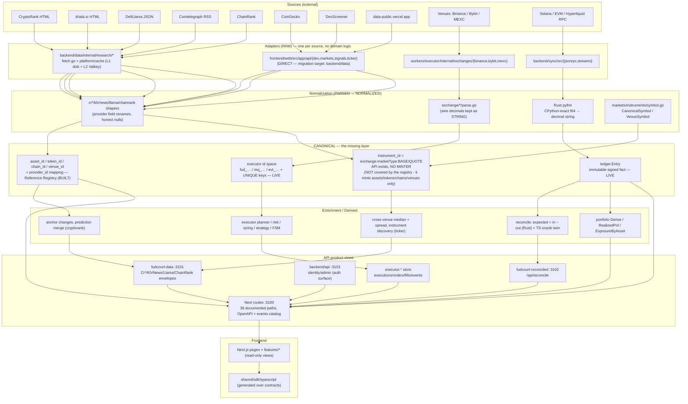

# Canonical Data Architecture — entities, layers, contracts

> **What this document is.** The canonical data model the repo actually implements today, layer by
> layer, entity by entity — with the exact code location of every claim, and an explicit "absent —
> no owner yet" wherever a layer or an entity has no implementation. It is the grounding document
> for `shared/contracts/schemas/**` (added in the same change) and the input to Phases 5–9 of
> `migration-plan.md`.
>
> **What this document is not.** It is not a migration and it authorizes no renames. The
> reference-registry change noted above *did* add code (`backend/api/internal/markets/reference/`)
> and a generated artifact (`shared/contracts/data/reference.json`); it renamed nothing, changed no
> behaviour, and its evidence is rows 11–18 of §11. Everything
> below is descriptive plus a named DECISION per duplicate concept; the required changes are
> recorded, not performed (`migration-plan.md` Phase 5+).
>
> **Snapshot.** Working tree of branch `refactor/frontend-backend-architecture` at `8c902dc`
> (`refactor: move apps/services/packages/deploy to frontend/backend/shared/infrastructure`).
> *The commit subject quoted here is the move that produced the current tree; the names it uses
> are pre-move — `apps/`, `services/`, `packages/`, `deploy/` no longer exist (see
> `final-review.md` §1).*
> A concurrent, uncommitted domain-reslice was in flight while this was written (staged renames
> visible in `git status --porcelain`: `backend/data/internal/{cryptorank,khala,llama,news,chainrank}`
> → `backend/data/internal/research/*`, `backend/data/internal/{cache,httpx}` →
> `backend/data/platform/*`, and `backend/api/internal/{ledger,portfolio,transactions,treasury}` →
> `backend/api/internal/finance/*`, `{exchangeaccounts,wallets}` → `backend/api/internal/accounts/*`,
> `{authorization,credentials,entitlements,identity}` → `backend/api/internal/access/*`,
> `{markets}` → `backend/api/internal/markets/{instruments,overview}`).
> **All paths cited below are the post-move paths**, i.e. the paths a reader of the tree sees now.
> Where a path is the target of an in-flight rename it is marked `⟳moved`. No file under
> `backend/**` was modified by this workstream.
>
> **Path flux (read this before grepping a citation).** `backend/api/internal` is being regrouped
> into domain folders while this document is written. Two shapes are observable in the same tree:
> `internal/{instruments,markets,ledger,treasury,transactions,portfolio,exchangeaccounts,wallets,authorization,credentials,entitlements,identity,platform}` (pre-regroup, still resolvable for some
> packages at some moments) and
> `internal/{markets/{instruments,overview}, finance/{portfolio,treasury,transactions,ledger}, accounts/{exchange,wallets}, access/{identity,credentials,authorization,entitlements}, notifications, jobs, audit, platform/{errs,health,httpx}}` (post-regroup).
> Older paths such as `internal/instruments`, `internal/ledger`, `internal/exchangeaccounts` no
> longer resolve. **Every citation below is the path that resolved when the file was read**, and
> owners are named by package (`backend/api markets/instruments`) rather than by frozen path. The
> same applies to `frontend/web/src/features/{signals/scoreboard.tsx → scoreboard/scoreboard.tsx}`
> and to `backend/sync/src/{db.rs → persistence/db.rs, sync.rs → streams/sync.rs, reconcile.rs →
> reconciliation/reconcile.rs, server.rs → reconciliation/server.rs}`.
> This document was not blocked on the regroup and did not perform it.
>
> Consequently: **every citation under `backend/data/internal/research/*`, `backend/data/platform/*`,
> `backend/sync/src/{persistence,streams,reconciliation}/*`, the regrouped `backend/api/internal/*`
> folders, and `frontend/web/src/features/scoreboard/*` is a path moved mid-audit** — both the old
> and the new shape were observed in the same working tree during this audit. The old locations are
> named once here rather than repeated at every line reference.
>
> **Evidence rule.** Every factual claim carries `path:symbol` or `path:line`. A claim that could not
> be read directly is marked `[INFERENCE]`. A search that returned nothing is reported with the
> search that returned nothing — "absent" here means *I grepped and show you the grep*, not *I did
> not look*.
>
> **Provenance of this task.** Written against the task brief supplied to this audit; that brief is
> not stored in-repo, so nothing here cites it — every claim stands on a repository path instead.

> **Update — the CANONICAL layer acquired an owner while this document was in review.** A later
> change in the same workstream added
> `backend/api/internal/markets/reference/` (package `reference`), which mints and resolves the
> canonical ids for exactly the four entities this audit recorded as having none: **Asset, Token,
> Chain, Venue**. Everywhere below that still reads *"absent — no owner yet"* for one of those four
> is the state **before** that change; the sections that follow the marker
> **[CANONICAL OWNER]** give the current state. The same marker also covers a second change that
> answers **O4**: `backend/api/internal/markets/instruments/canonical.go` mints `instrument_id`
> from the registry's resolved components (see D5, and §2.1 `Instrument`). `Price`, `Balance`, `Pool`, `Protocol`, `Signal`,
> `NewsArticle`, `Source`, `MacroSeries`, `MacroObservation`, `Transaction` and the account/ledger
> entities are **unchanged by that change and remain without a canonical identity**.
>
> **Path re-verification.** Every repository path in this document was re-tested with `test -f`
> after the mid-flight regroup: 86 path-like citations, all resolve. (The three apparent misses were
> a prose package name — `backend/api markets/instruments` — and two paths written without their
> `features/` / `scripts/` segment, now corrected to
> `frontend/web/src/features/executor/ui.tsx` and
> `tests/oracle/dump-envelopes.ts` — *the latter has since been relocated by the Phase-8 tests
> move; it was `frontend/web/scripts/tools/dump-envelopes.ts` when this note was written*.)
> Citations where both the pre- and post-regroup
> shapes were observed are marked *"path moved mid-audit"*.
>
> **Re-run against the current file.** The same extraction was repeated over this file as it stands
> now (after the executor tree was regrouped a second time): **265 path-like citation occurrences
> (128 distinct)** were found (a count taken before this note was appended; this note adds three
> more occurrences and no new distinct path), of which **114 resolve and 14 do not**. The 14 misses are all
> `backend/workers/executor/internal/*` citations still in the pre-regroup shape —
> `internal/exchange` and `internal/exchange/{binance,bybit,mexc}/*.go`
> (→ `internal/exchanges…`), `internal/{orders,executor}` (→ `internal/core/orders`,
> `internal/core/execution`), `internal/{planner,risk,sizing}` (→ `internal/core/*`),
> `internal/strategy/strategies.go` (→ `internal/strategies/strategies.go`),
> `internal/{decimal,idempotency}/…` (→ `internal/platform/decimal/decimal.go`,
> `internal/runtime/idempotency/idempotency.go`), and
> `frontend/web/src/platform/executor/ui.tsx` (→ `frontend/web/src/features/executor/ui.tsx`) —
> the same class of mid-flight move the paragraph above already records; they are named here
> rather than silently rewritten.

---

## 0. The one-paragraph summary

FUDCourt has **two and a half pipelines**. The **executor plane** (`backend/workers/executor`) is a
real canonical pipeline: exact decimal strings end-to-end, minted id spaces (`fud_…`, `req_…`,
`evt_…`), a venue-agnostic order/fill/execution model, and a durable store. The **treasury plane**
(`backend/sync` Rust + `frontend/web/src/platform/db` + `database/schema/*.sql`) is a
snapshot **product view** written straight to SQL, with number formatting as its compatibility
contract (`pyfmt.rs`) and no canonical identity at all. The **research/acquisition plane**
(`backend/data`) is a set of provider-shaped passthroughs: it normalizes *field names* and
*honest absence* very carefully, and it never mints an internal id. **There is no CANONICAL layer
between NORMALIZED and ENRICHED for any entity except instruments and the executor id space** — and
the two id spaces it does have (`InstrumentID`, `VenueKey`) currently have no producer that mints
them outside tests. That absence, not any individual bug, is the architecture's central fact.

---

## 1. The pipeline: seven layers, per layer location or absence

Layer vocabulary used throughout (`README.md` in `shared/contracts/schemas/` repeats it):

| # | Layer | Definition |
|---|---|---|
| 1 | **RAW** | The bytes as received from an upstream/venue, plus the acquisition machinery (cache, single-flight, retries). No domain types. |
| 2 | **PARSED** | The raw payload turned into typed values (structs/interfaces) that still have the upstream's own shape and field names. |
| 3 | **NORMALIZED** | Provider-specific shape with the provider's naming reconciled into *this repo's* names and units, honest nulls enforced. Still provider-shaped: one struct per provider surface. No cross-provider identity. |
| 4 | **CANONICAL** | Provider-neutral entities with minted identities + provider-id mappings, so Binance's `BTCUSDT` and CryptoRank's `bitcoin` and CoinGecko's `bitcoin` resolve to one row. |
| 5 | **ENRICHED** | Canonical facts joined to other canonical facts (cross-venue median, reconciliation diff, anchor-derived change). |
| 6 | **DERIVED** | Computed domain quantities (P&L, exposure, risk, position sizing, state-machine transitions). |
| 7 | **PRODUCT VIEW** | The wire envelope/response shape a route returns, including provenance fields (`upstream`, `fetchedAt`, `cache`, `slice`) and truncation markers. |

### 1.1 RAW

| Implementation | Location | Note |
|---|---|---|
| CryptoRank fetch + L1 disk cache | `backend/data/internal/research/cryptorank/fetch.go:48` (`PageProps map[string]interface{}`), `:318` (`Fetcher.Fetch`), `:228` (`readCache`, mtime TTL), `:258` (`writeCache`, atomic tmp+rename), `:343` (`singleFlight`), `:556` (`resolveBuildID`, 1 h cache) | Regex-extracts `__NEXT_DATA__` from HTML, unmarshals into an **untyped** map (`:459-475`). TTL is a fetch *argument* (default 60 s, `cmd/data/main.go:33`); `fresh=1` sets ttl 0. |
| Khala fetch | `backend/data/internal/research/khala/fetch.go` | ETag revalidation, 404 marker, atomic writes. |
| News fetch | `backend/data/internal/research/news/fetch.go` | In-process TTL + single-flight + Valkey L2. |
| Llama / ChainRank fetch | `…/research/llama/fetch.go`, `…/research/chainrank/fetch.go` | Both use the shared L2. |
| Shared L2 cache | `backend/data/platform/cache/cache.go:147` (`Key(family, url)`), `:104` `Get`, `:129` `Set`, `:163` `Encode`/`:174` `Decode` | Keyed on **upstream URL**, family-namespaced. Explicitly **not** consulted by cryptorank (grep `platform/cache` in `…/research/cryptorank` → no matches); used by chainrank (`chainrank/fetch.go:257`), llama (`llama/fetch.go:285`), news (`news/fetch.go:268`). |
| Response writer | `backend/data/platform/httpx/json.go:35` (`SetEscapeHTML(false)`) | Byte-compatibility with `JSON.stringify`. |
| Rust RPC/stream acquisition | `backend/sync/src/jsonrpc.rs` (`rpc:14`, `hexint:86`, `pad_addr:110`), `backend/sync/src/streams/sync.rs` (`sync_solana:147`, `sync_evm:207`, `sync_hyperliquid:301`) | Balance reads from Solana RPC, EVM `eth_call`, Hyperliquid `info`. |
| Next.js direct-to-upstream (no sidecar) | `frontend/web/src/features/dex/client.ts:10` (DexScreener), `features/markets/client.ts:13` (CoinGecko), `api/signals/route.ts:6` (`https://data-public.vercel.app`), `features/ticker/venues.ts:82` (ccxt clients) | Four families bypass the Go sidecar entirely. |
| Executor venue REST | `backend/workers/executor/internal/exchanges/{binance,bybit,mexc}/*.go` + `exchanges/http.go` | Signed venue calls. |

Owner: **`backend/data`** for the five research families; **`backend/sync`** for chain/CEX balance
streams; **`backend/workers/executor`** for venue trading APIs; **`frontend/web`** for
dex/markets/signals/ticker (documented acquisition debt, `docs/architecture/domain-map.md` §3.1).

### 1.2 PARSED

| Implementation | Location | Note |
|---|---|---|
| CryptoRank | **absent as a typed layer.** `backend/data/internal/research/cryptorank/shapers.go:17` (`func ShapeCoin(r map[string]interface{}, …)`) reads raw maps key-by-key; there is no `CrWire*` struct. | The nearest thing is the coercion boundary `…/cryptorank/value.go:17` (`asNum`), `:27` (`asNumLoose`), `:150` (`jsNumber`) — JS-semantics scalar ports. |
| Khala | `…/research/khala/parse.go` — `ParseHome` (cards), `ParseSitemap` (slugs), `ParseReport` (body/sections/authors/date) | Typed parse output (`khCard`/`KhBlock`/`KhSection`/`KhAuthor`/`ParsedReport`). |
| News | `…/research/news/parse.go:23` (`Item{title,link,description,pubDate,image,source}`) | Regex RSS extractor; the parse output *is* the final wire shape. |
| Llama / ChainRank | `…/research/llama/shape.go` (`Unmarshal` into `json.RawMessage` rows), `…/research/chainrank/shape.go` (`isNumber`/`isArray` guards) | Llama deliberately keeps rows as raw JSON; chainrank spreads upstream verbatim. |
| Rust sync | `backend/sync/src/jsonrpc.rs:86` (`hexint`), `:110` (`pad_addr`); `streams/sync.rs:133` (`sol_lamports`), `:275` (`scale_dec`), `:292` (`hl_usd`) | Hex/lamport/scale decoding — the only place a chain's wire encoding is interpreted. |
| Executor adapters | `…/exchanges/binance/parse.go`, `bybit/parse.go`, `mexc/parse.go` | Typed venue wire structs whose numeric fields are **`string`** (see §5). |
| Next features | `features/*/client.ts` type declarations (`DexPair` `dex/client.ts:75`, `VenueQuote` `ticker/client.ts:185`, `NewsItem` `news/client.ts:28`, `KhRow` `khala/client.ts:60`, `LlamaProtocol` `llama/client.ts:41`, `MarketsCoin` `features/markets/client.ts:54`) | These are provider wire shapes declared in TS — PARSED, not DOMAIN. |

### 1.3 NORMALIZED

| Implementation | Location | Evidence |
|---|---|---|
| CryptoRank `Cr*` structs | `…/cryptorank/types.go:8-437` (43 exported types) | Header `types.go:2-5`: "Types mirror apps/web/lib/cryptorank.ts's Cr* interfaces exactly: the JSON tags are the wire contract" — *the quoted header is pre-move wording kept verbatim; that TS file is now `frontend/web/src/features/cryptorank/client.ts`*. Renames only: `price→PriceUsd`, `volumes.day.toUSD→DayVolUsd`, `funds[].name→[]string`. |
| CryptoRank shapers | `…/cryptorank/shapers.go:17,70,93,106,126,148,162,180,214,252,286,307,339,384,414,444,457,470,547,631` | Header `shapers.go:5-8`: "an absent upstream value becomes null rather than 0". |
| Envelope assembly | `…/cryptorank/envelope.go:36` (`Envelope`), 26 mode arms | Lines 45-53 stamp `fetchedAt`/`cache`. |
| Khala envelope | `…/research/khala/shape.go` (`BuildReport`, `List`) | |
| Llama projection | `…/research/llama/shape.go:210` (`projectProtocols`, 10-key projection), `:242` (`projectHistorical`) | Rows are `json.RawMessage`; only the projection is typed. |
| Rust number rendering | `backend/sync/src/pyfmt.rs:20` (`round4`), `:34` (`round_n`), `:46` (`round10`), `:52` (`round2`), `:59` (`repr`), `:120` (`json_str`) | Module doc `pyfmt.rs:1-11`: CPython-identical rendering. **This is the treasury plane's de-facto numeric normalization.** |
| Venue symbol normalization | `backend/api/internal/markets/instruments/symbol.go:35` (`CanonicalSymbol`), `:81` (`VenueSymbol`) | `analyse → BASE/QUOTE`; `quoteSuffixes:13` is a hard-coded spelling table. |
| Feature-side shapers | `frontend/web/src/features/cryptorank/shapers.ts` (1198 lines: `asNum:71`, `asNumLoose:74`, `shapeCoin:93`, `envelope:276`) | **Note:** this module is importable but the runtime path is Go — its only consumers are `frontend/web/tests/shaper-tests.ts:22` and `tests/oracle/dump-envelopes.ts:54` (moved there by Phase 8). It is the TS mirror, not the live NORMALIZED layer. |
| Go↔wire float identity | `…/cryptorank/parity_test.go:170-173` (`walkNumbers:320`) | Asserts Go `encoding/json` renders the same literals JS does (`11500000`, `0.005551724137931036`). |

### 1.4 CANONICAL — **[CANONICAL OWNER]** owner exists for Asset/Token/Chain/Venue; still absent for the rest.

> **Before the `reference` package** (the state the rest of this subsection describes, kept because
> it is the evidence the audit produced): two id spaces existed in code, neither had a producer
> outside tests, and there was no provider-id mapping anywhere in the repo.

**The owner is `backend/api/internal/markets/reference`.** It mints a stable, opaque, process-
independent id for Asset, Token, Chain and Venue, and owns the only `(provider, provider_id) →
canonical_id` table in the repo (49 mappings, 3 recorded misses at the time of writing). It is the
concrete answer to D-CANON, O1 and O3 below.

| What it provides | Location | State |
|---|---|---|
| Id rule | `backend/api/internal/markets/reference/ids.go` (`MintID`, `MintIDWithSalt`, `Salt`, `IDHexLen`) — `id = kind ":" hex(sha256(salt 0x00 kind 0x00 naturalKey)[0:10])` | **Live.** Deterministic; the natural key per kind is documented in the package doc (`reference.go`) and travels inside the emitted document (`document.go` `Document.IDRule`). |
| Canonical entity types | `…/reference/types.go` (`Asset`, `Token`, `Chain`, `Venue`, plus `ProviderID`) | **Live.** These are the shapes `shared/contracts/schemas/{assets,markets}/*.json` describe. |
| Seed data | `…/reference/seed.go` (`Seed()`: 9 chains, 8 assets, 11 tokens, 12 venues) | **Live.** Curated, not scraped: the provider feeds do not supply ids. |
| Registry + resolution | `…/reference/registry.go` (`Build`, `Resolve`, `ByID`, `ChainByName`, `TokenByAddress`, `VenueByName`) | **Live.** `Resolve` refuses an unknown provider (`ErrUnknownProvider`) and an unknown identifier (`ErrUnknownIdentifier`), matches the identifier **verbatim**, and never resolves through a symbol. |
| Cross-service artifact | **`shared/contracts/data/reference.json`** (19,565 bytes) — emitted by `…/reference/cmd/emit`, pinned by `TestReferenceArtifactIsCurrent` | **Live.** This is the file another language reads; it carries `document_version`, `id_rule`, `salt`, the sorted entity lists, the whole resolution table, the honest `unmapped` list (7 known-unknown classes) and `misses` (3 identifiers reported by a feed that the registry refuses to invent an id for). It is what makes "backend/api owns the registry" true for `frontend/web`, `backend/data` and `backend/sync` alike, which cannot import Go. |
| Tests | `…/reference/{registry_test.go,document_test.go}` | **Live.** 16 tests: id pinning, determinism under shuffled insertion order, round-trip through the artifact, and document-integrity refusal cases. |

The instrument id space is minted by a SECOND package,
`backend/api/internal/markets/instruments` (`canonical.go`), from the components the registry
resolves: `instrument_id = "instrument:" + sha256("fudcourt/canonical-instrument/v1" NUL
"instrument" NUL "instrument/<venue_id>/<market_type>/<base_asset_id>/<quote_asset_id>/<settlement_asset_id>")[0:10]`.
It shares the registry's hashing (`reference.MintIDWithSalt`) but not its salt, namespace or
document — see §2.1 `Instrument` and D5.

What this closes and what it does not. It closes **Asset, Token, Chain and Venue** as *canonical
entities with an id space and a provider mapping*, and **Instrument** as a canonical entity whose id
is minted from them. It does **not** close `Price`, `Balance`, `Pool`,
`Protocol`, `Signal`, `NewsArticle`, `Source`, `MacroSeries`, `MacroObservation`, `Transaction`,
`LedgerEntry`, `Account` or `Position` — those keep the status stated below. It also does not make
the registry *persisted*: the artifact is a generated file, so the registry is durable through
version control, not through a database.

| What exists | Location | State |
|---|---|---|
| Instrument id | `backend/api/internal/markets/instruments/instrument.go:53` (`InstrumentID string`), documented canonical form `exchange:marketType:BASE/QUOTE` — evidenced by the fixture `…/instruments/instrument_test.go:13` (`"binance:spot:BTC/USDT"`) | **No producer.** grep `InstrumentID` across the repo → 12 hits in 4 files: the struct field, its own test, `finance/portfolio` (derived exposure key, `portfolio.go:50`), and `portfolio_test.go`. Nothing mints it from a venue payload. |
| Executor id space | `backend/workers/executor/internal/runtime/idempotency/idempotency.go:38-40` (`fud_<executionId>_<seq>`), `:136-138` (`req_…`), `:83-85` (`FillDedupKey(accountID, exchangeTradeID)`); `repository/store.go:125-127` (`evt_…`) | **Live and durable.** This is the one place identity is minted and enforced by a UNIQUE constraint (`executor-schema.sql:122`, `:141`). |
| Venue key (TS) | `frontend/web/src/platform/executor/types.ts:54` (`VenueKey`), `:1366` (`venueKey()`) → `` `${exchange}:${marketType}:${symbol}` `` | Mirrors the Go instrument id; declared, used by the executor plane. |
| Chain identity | **[CANONICAL OWNER]** 9 chains with minted ids (`reference/seed.go`, ids emitted in `shared/contracts/data/reference.json`). Original finding: `backend/sync/src/chains.rs:13` (`EVM` table), `:79` (`WALLETS`), `:98` (`LLAMA_IDS`) | A **static Rust registry** — the closest thing to a chain registry in the repo, and it is per-process, not durable. `[INFERENCE]` It cannot serve as the canonical registry because nothing outside `backend/sync` can read it. |
| Asset identity | **[CANONICAL OWNER]** `backend/api/internal/markets/reference` (`MintID`/`Seed`/`Resolve`), artifact `shared/contracts/data/reference.json`. Original finding, kept as the evidence: `[INFERENCE]` none. grep `canonicalId|provider_id|external_id|asset_id|symbol_map|asset_map|registry` over `frontend/web/src/platform`, `shared/sdk/typescript/src`, `backend/api/internal`, `backend/data`, `backend/sync/src`, `database/` → only `platform/executor/exchange.ts:705` ("Capability registry (PRD §50) — static") and a generated field name. | **[CANONICAL OWNER]** ids are now minted (`reference/ids.go`) and the provider mapping is published (`reference.json`). The original finding stands for **SQL only**: no aliases/external_ids/provider_ids table, column or index exists in any `.sql` file (`database/README.md` and all three schemas), so the canonical-id guarantee still cannot be delivered by field renames alone — it needs the artifact to be loaded. |
| Provider→canonical mapping | **[CANONICAL OWNER]** the mapping now exists — `…/reference/registry.go` (`Resolve`) over the table emitted in `shared/contracts/data/reference.json`, populated from `…/reference/seed.go`. The gap this row originally recorded was in **SQL**: `database/schema/executor-schema.sql` still has no mapping table; `pg-schema.sql` has only `price_history(symbol, ts, source)` (`:140-141`), whose unique key is `(symbol, ts, source)` — i.e. **symbol-as-identity persists in the schema**. `price_history` has **no writer in the repo** (its DDL comment `:131` says "Written by the price sampler"; grep finds only the retention DELETE at `frontend/web/src/platform/db/mirror.ts:208`). | **[CANONICAL OWNER]** delivered for Asset/Token/Chain/Venue by `backend/api/internal/markets/reference` (see §1.4 heading); the *SQL* half of the blocker stands — no mapping table exists in `database/`, so a resolver reading the database still has none. |

Provider-specific parsers that **already exist** and the layer they occupy (requested explicitly):

| Parser | Path | Layer |
|---|---|---|
| CryptoRank page→`Cr*` | `backend/data/internal/research/cryptorank/{fetch,shapers,value,types,envelope,marshal,modes}.go` | RAW→NORMALIZED→PRODUCT VIEW in one package; no PARSED, no CANONICAL |
| Khala HTML→`KhEnvelope` | `…/research/khala/{fetch,parse,shape,modes}.go` | RAW→PARSED→PRODUCT VIEW |
| Llama JSON→projection | `…/research/llama/{fetch,shape,modes}.go` | RAW→NORMALIZED→PRODUCT VIEW |
| News RSS→`Item` | `…/research/news/{fetch,parse,shape,modes}.go` | RAW→PARSED(=wire)→PRODUCT VIEW |
| ChainRank spread | `…/research/chainrank/{fetch,shape,modes}.go` | RAW→PRODUCT VIEW |
| DexScreener→`DexPair` | `frontend/web/src/features/dex/client.ts:75` | RAW→PARSED (string prices preserved) |
| CoinGecko→`MarketsCoin` | `frontend/web/src/features/markets/client.ts:54`, route shaping `api/markets/route.ts:159-201` | RAW→NORMALIZED→PRODUCT VIEW |
| ccxt→`VenueQuote`/`TickerRow` | `frontend/web/src/features/ticker/client.ts:185,254`, `instruments.ts:94` | RAW→NORMALIZED→ENRICHED→PRODUCT VIEW |
| Signals→`SignalRow` | `frontend/web/src/app/(frontend)/api/signals/route.ts:10` | RAW→PRODUCT VIEW |
| Venue REST→`Order`/`Fill`/`Balance` | `backend/workers/executor/internal/exchanges/{binance,bybit,mexc}/parse.go` | RAW→PARSED→NORMALIZED→(CANONICAL via executor ids) |

### 1.5 ENRICHED

| Enrichment | Location | Inputs → output |
|---|---|---|
| Change vs price anchor | `…/cryptorank/shapers.go:58` (`ChangeFromAnchor`), `:70` (`ShapeListing`), `:214` (`ShapeCoinDetail`); coverage counters `envelope.go:779` (`anchorCount`), provenance `ChangeSource` `envelope.go:28-31` | `histPrices['24H'/'7D']` + current price → percent, **labelled** as derived. |
| Prediction aggregate | `…/cryptorank/shapers.go:470` (`ShapePrediction`) | 3 upstream responses merged by platform **name** (in-payload join, `:475-514`). |
| RWA detail key | `…/cryptorank/shapers.go:366` (`RwaDetailKey`) | `type→plural/slug` path construction. |
| Cross-venue median/spread | `frontend/web/src/app/(frontend)/api/ticker/route.ts:352` (spot median), `:399-400` (`spreadBetween`), `:409` (median price), `:412-415` (median change), `:418-419` (max high/min low), `:420` (median volume); grouping key `:385` = `` `${symbol}|${type}|${settle ?? ''}` `` | Per-venue quotes → one board row. |
| Instrument discovery | `frontend/web/src/features/ticker/instruments.ts:94` (`instrumentsFor`), `:166` (`defaultInstrument`), `:204` (`expiriesFor`), `:213` (`strikesFor`) | ccxt market maps → expiry/strike sets. |
| Presence measurement | `frontend/web/src/features/dex/client.ts:116` (`pairMetricPresence`) | rows → per-field coverage counts (honest "we did not measure" vs 0). |
| Cash reconciliation | `backend/sync/src/reconciliation/reconcile.rs:113` (`reconcile`), `:177` (`summary_map`) | balances + transactions → `expected = in − out`, `diff = current − expected`; keys on string `(wallet, asset)` with fallbacks `("Unknown","Unknown")` `:121-125` and `("USDT")` `:127-131`. TS oracle twin: `frontend/web/src/features/treasury/reconcile.ts:27`. |
| Alert routing plan | `backend/api/internal/notifications/notifications.go:179` (`Route`), `:196` (`Plan`) | request + preferences → planned deliveries. |

### 1.6 DERIVED

| Derivation | Location |
|---|---|
| Portfolio valuation/exposure | `backend/api/internal/finance/portfolio/portfolio.go:97` (`Derive`, stamps `AsOf = time.Now().UnixMilli()` at `:140`), `:169` (`ExposureByAsset`), `pnl.go:59` (`RealizedPnl`) |
| Transaction view merge | `…/finance/transactions/transactions.go:72` (`DirectionOf`, sign rule `:42-52`), `:158` (`Merge`) |
| Balance from entries | `…/finance/ledger/ledger.go:179` (`BalanceByAsset`) |
| Book touch snapshot | `backend/api/internal/markets/overview/snapshot.go:24` (`SnapshotFromTicker`), `:6` (`Snapshot`) |
| Executor planning/risk/sizing/strategy/FSM | `backend/workers/executor/internal/{planner,risk,sizing,strategy,orders,execution,worker}` (19 packages) |
| Executor reconciliation merge | `…/internal/worker/tick.go:325` (`reconcile`), `:52-59` (venue-truth-first), `helpers.go:26` (`matchVenue`), `:123` (`cmpDec`) |
| Client-side display/statistics | quarterly return `frontend/web/src/features/cryptorank/ui.tsx:1633-1634`; signals stats `features/signals/ui.tsx:157-172`; cohort hit-rates `features/scoreboard/scoreboard.tsx:31-80`; group sums `shell/store-shell.tsx:107-109`; TVL sparkline `features/llama/ui.tsx:105-113` |

### 1.7 PRODUCT VIEW

| View | Location | Provenance honesty |
|---|---|---|
| CryptoRank envelope | `…/cryptorank/types.go:438` (`CrEnvelope`), `envelope.go:36`; `marshal.go:12` (`Num` = present-null vs omitted key), `:43` (`marshalNoEscape`), `:57` (`Row` union) | `kind/upstream/fetchedAt/cache/count/upstreamTotal/slice/changeSource` |
| Khala / News / Llama / ChainRank envelopes | `…/research/{khala/shape.go, news/shape.go:41, llama/shape.go:112, chainrank/shape.go}` | `fetchedAt`, `upstream`, `count` vs `total`, `derived` label (llama `:68` in TS) |
| Feature response types | `features/{ticker,markets,dex,signals,news,khala,llama,chainrank,executor}/client.ts` | labels like `slice`, `derived`, `failed[]` |
| Executor API views | `shared/contracts/openapi/fudcourt.yaml:1903` (`components.schemas`), route-local admin views `backend/api/cmd/api/routes.go:244,257,264,297` | OpenAPI is the frozen contract for 36 paths. |
| Event wire | `shared/contracts/events/catalog.json`, `events/event.schema.json`, `schemas/event-envelope.json` | 28 stable event ids + aliases; `event_version: 1`. |

---

## 2. Canonical entity list

Conventions for every row: **Identity** gives the internal canonical id and the provider_id mapping;
`symbols are NOT identity` is the rule, and every "symbol-as-key" sighting is a defect listed in §7.
**Owner** is exactly one service+package. **Counterpart** is the code that exists today.

### 2.1 Market/reference entities

| Entity | Definition | Identity (canonical + provider mapping) | Domain | Primary owner | Providers feeding it | Code counterpart |
|---|---|---|---|---|---|---|
| **Asset** | A fungible unit of value in a portfolio/ledger, named by symbol within a chain or in USD terms. | **[CANONICAL OWNER]** `asset:<10 hex>` = `sha256(salt 0x00 "asset" 0x00 "asset/<kind>/<SYMBOL>")[0:10]` (`reference/ids.go` `MintID`, `reference.go` package doc); natural key `asset/<kind>/<SYMBOL>` where `<kind>` is one of native, fiat, stablecoin; provider ids per asset in `shared/contracts/data/reference.json` (`provider_ids`). 8 assets seeded (`reference/seed.go`). | assets | **`backend/api/internal/markets/reference`** | CoinGecko (`markets`), CoinRank/CryptoRank, chain RPCs (Rust sync) | `finance/ledger/ledger.go:74` (`Entry.Asset`), `finance/transactions/transactions.go:55`, `finance/portfolio/portfolio.go:27`, `finance/treasury/treasury.go:40`, `markets/instruments/instrument.go:54-55`; SQL `assets.asset` `database/schema/schema.sql:12` |
| **Token** | One on-chain contract instance: an address/mint on a specific chain. Distinct from Asset because the same asset has many contracts (bridged/wrapped). | **[CANONICAL OWNER]** `token:<10 hex>` over natural key `token/<chain-name>/<FULL address, verbatim casing>` (`reference/ids.go`; 11 tokens seeded). The id is **not** lossy: the full address is the natural key, so the Rust SPL truncation below cannot corrupt it. Original finding: **Absent.** `[INFERENCE]` the intended id is `chain:address`; today identity is the raw address, and Rust **truncates** SPL mints to 6 chars (`backend/sync/src/streams/sync.rs:186-192`, `format!("SPL:{short}")`) so the id is lossy. | onchain / assets | **owner absent** — nearest: `frontend/web/src/features/dex` (read-only) | DexScreener, Solana/EVM RPC | `features/dex/client.ts:73` (`DexToken{address,name,symbol}`), `:65` (`addressKind` — base58/hex/name family classifier) |
| **Chain** | A settlement domain (L1/L2) with its own address format. | **[CANONICAL OWNER]** `chain:<10 hex>` over natural key `chain/<lowercase name>`; 9 chains seeded with `kind` (`evm`/`svm`/`offchain`) and `display_name`, emitted in `shared/contracts/data/reference.json`. Original finding: **Absent as a durable entity** — `backend/sync/src/chains.rs:13` (`EVM`), `:79` (`WALLETS`) was twice-removed state. | onchain | **`backend/api/internal/markets/reference`** (ids); `backend/api/internal/accounts/wallets` still validates the label | Solana/EVM RPC, Hyperliquid, CryptoRank (`CrChainRow`), ChainRank | `accounts/wallets/wallets.go:68-76` (`chainRules`, 7 chains), `finance/transactions/transactions.go:54` (`Chain` free-form + `DefaultChain="Offchain"` `:35`); `…/cryptorank/types.go:132` (`CrChainRow.Slug`) |
| **Venue** | A place orders can be placed and balances held: a CEX, or a DEX protocol instance. | **[CANONICAL OWNER]** `venue:<10 hex>` over natural key `venue/<venue-id>` (the id the tree already uses); 12 venues seeded, `known` + `market_types` carried. The three inline allowlists still exist (§7) and are now *redundant*, not authoritative. Original finding: **Absent as an entity** — identity was a hard-coded lowercase name enforced three times. | markets / trading | **`backend/api/internal/markets/reference`** | Binance/Bybit/MEXC REST, ccxt, DexScreener | `accounts/exchange/account.go:122-125` (`KnownExchange`), `markets/instruments/symbol.go:50-51,88-91`, `accounts/wallets/wallets.go:57-61`; SQL `venues(id TEXT PK)` `schema.sql:71-75` — **no writer in the repo** |
| **Instrument** | One tradable market on one venue, with its price/quantity grid. **This is the only near-complete canonical entity in the repo.** | **[CANONICAL OWNER]** `instrument_id = "instrument:" + sha256("fudcourt/canonical-instrument/v1" NUL "instrument" NUL naturalKey)[0:10]`, naturalKey = `instrument/<venue_id>/<market_type>/<base_asset_id>/<quote_asset_id>/<settlement_asset_id>` — resolved components only, never a spelling (`markets/instruments/canonical.go`). The legacy spelling `InstrumentID` = `exchange:marketType:BASE/QUOTE` (`instrument.go:53`; form evidenced `instrument_test.go:13`) is retained unchanged as `InstrumentSpelling`. Provider mapping: `ExchangeSymbol` (`:60`) + `CanonicalSymbol`/`VenueSymbol` (`symbol.go:35,81`) resolve the spelling; `ResolveInstrument` bridges it to the minted id. | markets | **`backend/api/internal/markets/instruments`** (`canonical.go`) | ccxt market maps, venue `exchangeInfo` | `markets/instruments/instrument.go:52` (+`canonical.go` for minting, `rounding.go:130,160` for grid rounding); executor mirror `platform/executor/types.ts:54,1366` |
| **Price** | A point observation of value at a time from a named source. | **Absent as a type.** Current carriers are per-struct decimal strings and a schema table keyed by `symbol` — the exact anti-pattern. | markets | **owner absent** — `backend/api/internal/markets/overview` holds the shape | all market providers | `markets/overview/market.go:38` (`Ticker.Bid/Ask/Last`, decimal strings), `:84` (`MarkPrice`), `:93` (`IndexPrice`); SQL `price_history(symbol, ts, source, price double precision)` `pg-schema.sql:132-141` — **no writer** |
| **Candle** | One OHLCV bar for an instrument/interval. | Absent canonical id; tuple `(Exchange, Symbol, Interval, OpenTime)` is the de-facto key (`market.go:54` "Interval … identity of the bar series"). | markets | `backend/api/internal/markets/overview` | ccxt (`TICKER_TIMEFRAMES` `ticker/client.ts:174`, max 500 `:178`) | `markets/overview/market.go:50` (`Candle`); **no store**: SQL has no candle table (grep `candle` in `database/` → no matches) |
| **Protocol** | A DeFi protocol aggregate (TVL, chains, category). | Provider id is the DefiLlama `slug`; no canonical id. | defi | **owner absent** — nearest: `backend/data/internal/research/llama` | DefiLlama | `…/research/llama/shape.go:210` (`projectProtocols`); TS `features/llama/client.ts:41` (`LlamaProtocol{slug,tvl,category,chains}`) |
| **Pool** | A pairing of two tokens with reserves (a DEX pair/liquidity pool). | Absent. Identity is `pairAddress` (provider address) alone. | defi / onchain | **owner absent** | DexScreener | `features/dex/client.ts:75` (`DexPair{pairAddress,baseToken,quoteToken,liquidity:{usd,base,quote}}`); **no Go/SQL counterpart** |
| **Source** | The origin of a fact: an upstream feed, a venue, or a manual entry. | Absent as a type; a free string. | system (provenance) | **owner absent** | news feeds, chain scans, venues, manual | `finance/transactions/transactions.go:65` (`Transaction.Source`; `DefaultSource="manual"` `:37`; doc `:9-10` "Provenance survives every operation"); `news/modes.go` (one `Source` struct per feed); `price_history.source` column |

### 2.2 Accounts, positions, execution

| Entity | Definition | Identity | Domain | Primary owner | Providers | Code counterpart |
|---|---|---|---|---|---|---|
| **Account** | A place value is held. **Two genuinely different nouns share the name** (see §7). | `treasury.Account.ID` (string, internal) and `ExchangeAccount.ID` (uuid, `gen_random_uuid()`); on-chain "account" = wallet address PK. | accounts / treasury | **split**: `finance/treasury` (internal capital) + `accounts/exchange` (venue) + `accounts/wallets` (chain) | venues, chains | `finance/treasury/treasury.go:35`; `accounts/exchange/account.go:102`; `accounts/wallets/wallets.go:36` (address PK, `schema.sql:78`); SQL `accounts(code TEXT PK)` `schema.sql:4` — **no writer**; `executor.exchange_accounts` `executor-schema.sql:32` |
| **Balance** | A quantity of one asset held by one account at a time. | Absent as a type. Keys are `accountID`/`asset` strings; snapshots are untyped jsonb. | portfolio / ledger | **owner absent** for the read model; executor holds `Balance` records | venues, chains | `finance/ledger/ledger.go:179` (`BalanceByAsset map[string]string`), `finance/treasury/treasury.go:76` (`Balances map[string]string`); executor `executor/records.go:163` (`Balance{Asset,Free,Used,Total}` — decimal strings); SQL `ledger.balance double precision` `schema.sql:38`, `executor.balance_snapshots.payload jsonb` `executor-schema.sql:157-162` |
| **Position** | A held directional exposure. **Two distinct implementations exist, in different domains** (§7). | Venue position: `(symbol, positionSide)` — no synthetic id (`records.go:183,191`). Derived position: `InstrumentID` (`portfolio.go:50`). | trading / portfolio | **split**: `backend/workers/executor/internal/exchanges` (venue truth) + `finance/portfolio` (derived) | venues | `executor/records.go:182` (`Position{Quantity,EntryPrice,LiquidationPrice}` decimal strings); `finance/portfolio/portfolio.go:49` (`Position{InstrumentID,Quantity,EntryPrice,UnrealizedPnl}`) |
| **Order** | An instruction to trade, at a venue or as a managed child. | Minted: `clientOrderId = fud_<executionId>_<seq>` (`idempotency.go:38-40`); venue id recorded alongside (`ExchangeOrderID`). UNIQUE `(execution_id, client_order_id)`. | trading | **`backend/workers/executor/internal/core/orders`** (+ `idempotency`) | venues | `executor/records.go:76` (`ChildOrderRecord`), `:206` (`NormalizedOrder`), `:223` (`OrderRequest`); SQL `executor.child_orders` `executor-schema.sql:106-123` |
| **Fill** | One executed trade at a venue for one order. | Dedup key is the guarantee: UNIQUE `(account_id, exchange_trade_id)` (`executor-schema.sql:141`), computed by `idempotency.FillDedupKey` `:83-85`. | trading | **`backend/workers/executor/internal/exchanges`** (ingest) | venues | `executor/records.go:96` (`FillRecord`), `:237` (`Fill`); also `portfolio.EntryFill/ExitFill` `pnl.go:21,30` (P&L inputs, not the Fill entity) |
| **Execution** | One user intent run end-to-end (plan → child orders → fills), with an immutable plan snapshot. | Minted uuid PK; `RiskCalculated`… lifecycle in `executor.executions`; events minted `evt_<executionId>_<seq>`. | trading | **`backend/workers/executor/internal/core/execution`** | venues + own engine | `executor/records.go:13` (`ExecutionRecord`), `worker/tick.go`; SQL `executor.executions` `executor-schema.sql:58-93`, `execution_plans` `:100-104`, `execution_events` `:147-154`; contract `shared/contracts/events/catalog.json` |
| **Transaction** | A user-visible money-movement history row (on-chain event or manual entry). | SQL surrogate `id INTEGER PK AUTOINCREMENT` (`schema.sql:57`). No canonical id. | portfolio / ledger | **`backend/api/internal/finance/transactions`** | chain scans, manual, venue exports | `finance/transactions/transactions.go:51`; SQL `transactions` `schema.sql:56-69`; writer `frontend/web/src/app/(frontend)/api/transactions/route.ts:78,116` |
| **LedgerEntry** | An immutable, signed financial movement of one asset against one account. **The repo's canonical money fact.** | `Entry.ID` string + a natural idempotency key `(AccountID, Kind, ReferenceType, ReferenceID, OccurredAtMs)` (`ledger.go:127-141`) with `Amount`/`CreatedAt` deliberately excluded (`:131`). | ledger | **`backend/api/internal/finance/ledger`** | treasury movements, executions, fees, reconciliation adjustments | `finance/ledger/ledger.go:71`; **schema counterpart is misleading**: SQL `ledger` table (`schema.sql:33-40`) is a per-account balance snapshot with **no writer**, and is *not* the entry log |
| **Signal** | A scored, sourced detection of an opportunity/risk. | Provider `(id, mint)`; identity is composite and provider-owned. | signals | **owner absent** — `frontend/web` read proxy only | `data-public.vercel.app` | `api/signals/route.ts:10` (`SignalRow{id,ts,chain,mint,symbol,score,decision,…}`), `:44` (`ScoreboardPayload`) |
| **NewsArticle** | A published article or report from a named outlet. | Absent — `KhRow.slug` (khala) and RSS `link`/`title` (news) are the only keys; cryptorank news carries `ID *float64`. | news | **owner absent** — `backend/data/internal/research/{news,khala,cryptorank}` | Cointelegraph RSS, khala.io, CryptoRank news | `…/research/news/parse.go:23` (`Item`), `khala/shape.go` (`KhRow`/`KhReport`), `cryptorank/types.go:157` (`CrNewsRow`); TS `features/news/client.ts:28`, `khala/client.ts:60,70` |
| **MacroSeries** | A named macro time series (e.g. a rates or inflation series). | **Absent — no owner, no code.** | macro | **absent — no owner yet** | none | **Absent.** Evidence: grep `macro`, `fred`, `cpi`, `inflation`, `macroeconomic`, `yield`, `dxy`, `tbill` (case-insensitive) over `backend`, `frontend/web/src`, `shared`, `database`, `tests` → **zero** substantive matches (only Rust `*-macro*.json` build artifacts under `backend/sync/target/` and the word "yield" inside unrelated comments). There is no macro provider, table, route, or feature directory. |
| **MacroObservation** | One observation of a macro series at a time. | **Absent — no owner, no code.** | macro | **absent — no owner yet** | none | **Absent** (same grep as MacroSeries). |

> Requested entities with **no implementation at all**: **MacroSeries**, **MacroObservation**.
> Requested entities present but with **no canonical identity**: Asset, Token, Chain, Venue, Price,
> Balance, Pool, Protocol, Signal, NewsArticle, Source.
> Requested entities with a **minted, durable identity**: Instrument, Execution, Order, Fill,
> LedgerEntry (natural key).

---

### 2.3 Cross-service sharing mechanism

**The rule (`docs/architecture/target.md` §3.2, `migration-plan.md`): services share ONLY contracts
and MUST NOT import each other's Go/Rust/TS implementations.** So an entity is shared through four
separate artifacts, and they must be listed separately or "shared" is meaningless:

- **(a) canonical JSON Schema** — the path added by this change under `shared/contracts/schemas/`.
  This is the *normative* shape; it is what a generator or a reviewer reads.
- **(b) wire shape over HTTP** — which service *produces* the body, which service/route *consumes*
  it, and on which route. This is the only runtime channel between services today.
- **(c) per-service struct** — the owner's own type. Every service keeps its own; the contract does
  not let one service hand another its struct. `absent — not yet implemented` means exactly that.
- **(d) contract-visible vs internal-only fields** — a field is contract-visible only if some
  cross-service consumer reads it; everything else belongs to the owner and may change freely.
- **(e) an emitted id document** — for the two id spaces this model mints: the reference registry
  publishes `shared/contracts/data/reference.json`, which any language can read. Instruments are
  deliberately NOT in it (see the `Instrument` row below): they are unbounded per-venue markets,
  not reference data, so their ids are minted on demand by
  `backend/api/internal/markets/instruments` and have no emitted document yet.

**"Schema only — no runtime consumer yet"** marks an entity that has a schema but no live path. It
is an honest description, not a stub: the schema is the *first* artifact of a concept that two
services will share, and this repo would rather record the shape than imply a path that does not
exist.

| Entity | (a) Schema path | (b) Wire shape (producer → consumer) | (c) Owner struct | (d) Contract-visible / internal-only |
|---|---|---|---|---|
| **Asset** | `common/identifier.json`, `assets/asset.json` | **[CANONICAL OWNER]** `reference.json` is the wire form (`/chains`, `/assets`, `/tokens`, `/venues`, `/mappings`, `/unmapped`); no HTTP route serves it yet. Original: **schema only — no runtime consumer yet.** Today the symbol travels inside `transactions` (`frontend/web/src/app/(frontend)/api/transactions/route.ts` → browser) and inside the `assets` snapshot (`backend/sync` → Turso → `frontend/web/src/platform/db/mirror.ts` → Postgres → `/api/coins`). | **`backend/api/internal/markets/reference`** → `Asset` (`reference/types.go`) | n/a |
| **Token** | `assets/token.json` | **[CANONICAL OWNER]** carried in `reference.json` (11 tokens); no route serves it yet. Original: **schema only — no runtime consumer yet.** `DexToken` reaches the browser only from the Next route `api/dex/route.ts` (direct DexScreener call, no sidecar). | `frontend/web/src/features/dex/client.ts:73` (`DexToken`, TS only) | contract-visible: `chain_id`, `address`, `symbol`; internal-only: none yet |
| **Chain** | `assets/chain.json` | **[CANONICAL OWNER]** carried in `reference.json` (9 chains); no route serves it yet. Original: **schema only — no runtime consumer yet.** Read today as a free string on `transactions` rows and as a lowercase label in the `assets` snapshot; `backend/sync/src/chains.rs` is a private static registry, not a service. | **`backend/api/internal/markets/reference`** → `Chain` (`reference/types.go`) | n/a |
| **Venue** | `markets/venue.json` | **[CANONICAL OWNER]** carried in `reference.json` (12 venues, `known`, `market_types`); no route serves it yet. Original: **schema only — no runtime consumer yet.** The name string is echoed inside `executor.exchange_accounts.exchange` (`backend/api/internal/accounts/exchange` → executor store) and inside market-data rows. | **`backend/api/internal/markets/reference`** → `Venue` (`reference/types.go`) | contract-visible: `venue_id`, `known`, `market_types`; internal-only: the three inline allowlists |
| **Instrument** | `markets/instrument.json` | **[CANONICAL OWNER]** `instrument_id` is minted by `backend/api/internal/markets/instruments` (`canonical.go`), not by the reference registry: instruments are unbounded per-venue markets, so they are deliberately NOT emitted into `shared/contracts/data/reference.json`. A consumer gets an instrument id by calling `instruments.ResolveInstrument` with the built registry (`reference.Build()`), or from a future emitted artifact of this package. Contract exists and is **documented in the OpenAPI surface** (`shared/contracts/openapi/fudcourt.yaml:1903` components). Runtime: consumed in-process by `backend/workers/executor` (its own `executor.InstrumentMetadata` analogue), and by `frontend/web/src/platform/executor/types.ts:217` (`InstrumentMetadata`, TS). **No service currently serves an instrument record over HTTP.** | `backend/api markets/instruments` → `Instrument` (`markets/instruments/instrument.go:52`); TS `InstrumentMetadata` (`platform/executor/types.ts:217`) | contract-visible: `instrument_id`, `base_asset`, `quote_asset`, `market_type`, `exchange`, `exchange_symbol`, grid fields; internal-only: `contract_size` consumers inside sizing |
| **Price** | `markets/price.json` | **schema only — no runtime consumer yet.** `price_history(symbol, ts, source)` has a schema and a retention job but **no writer and no reader**; live prices reach the browser only as product-view rows (`VenueQuote`/`CrCoin`). | **absent — not yet implemented**; nearest is `backend/api markets/overview` `Ticker` (`markets/overview/market.go:38`) | contract-visible: `instrument_id`, `source_id`, `observed_at`, `price`; internal-only: `bid`/`ask` presence conventions |
| **Candle** | `markets/candle.json` | **schema only — no runtime consumer yet.** `ccxt` bars are read per request by `api/ticker/*` and never persisted (no candle table exists in `database/`). | `backend/api markets/overview` `Candle` (`markets/overview/market.go:50`) | contract-visible: `instrument_id`, `interval`, `open_time`, OHLCV; internal-only: `exchange`+`symbol` echo |
| **Account (venue-linked)** | `accounts/exchange-account.json` | `backend/workers/executor` / `frontend/web/src/platform/executor/store.ts` → Postgres `executor.exchange_accounts`; the read path is `api/executor/accounts/route.ts` → browser. `backend/api` produces the *candidate* record type but does not serve it. | `backend/api accounts/exchange` → `ExchangeAccount` (`accounts/exchange/account.go:102`); executor twin `platform/executor/types.ts:893` (`AccountMetadata`) | contract-visible: everything except `credential_id` resolution; **`credential_id` is contract-visible as an opaque handle, never the secret** |
| **Account (treasury)** | `finance/treasury-account.json` | **schema only — no runtime consumer yet.** No route serves treasury accounts; `accounts(code TEXT PK)` in Turso/Postgres has no writer. | `backend/api finance/treasury` → `Account` (`finance/treasury/treasury.go:35`) | contract-visible: `account_id`, `owner_kind`, `owner_id`, `asset`; internal-only: none |
| **Account (ledger chart)** | `finance/ledger-account.json` | **schema only — no runtime consumer yet.** Read only through the Postgres mirror projection (`platform/db/mirror.ts:51`) and `/api/all`. | **absent — not yet implemented** (bare `code`/`name`/`type`/`statement` columns, `database/schema/schema.sql:3-8`) | contract-visible: `code`, `name`, `type`, `statement`; internal-only: none |
| **Wallet** | `accounts/wallet.json` | `frontend/web/src/app/(frontend)/api/wallets/route.ts` ⇄ Turso/Postgres `wallets`; `backend/api accounts/wallets` owns the normalizer but is not wired to a route. | `backend/api accounts/wallets` → `Wallet` (`accounts/wallets/wallets.go:36`) | contract-visible: `chain_id`, `address`, `label`, `ownership`, `portfolio_linked`; internal-only: `emoji`/`color`/`notes` presentation |
| **Balance** | `accounts/balance.json` | **schema only — no runtime consumer yet.** Balances reach clients as product views (`/api/all`, `/api/coins`, executor `/api/executor/executions/[id]`) and as untyped `executor.balance_snapshots.payload` jsonb. | `backend/workers/executor` → `Balance` (`executor/records.go:163`) and `AccountEquity` (`:172`); `backend/api finance/ledger` `BalanceByAsset` map (`ledger.go:179`) | contract-visible: `account_id`, `asset_id`, `free`, `used`, `total`, `observed_at`; internal-only: snapshot payload |
| **Position** | `trading/position.json` | `frontend/web/src/platform/executor/runtime.ts` / `backend/workers/executor` → `executor.positions_snapshots.payload` jsonb → `/api/executor/executions/[id]` → browser. | venue truth: `backend/workers/executor` → `Position` (`executor/records.go:182`); derived: `backend/api finance/portfolio` → `Position` (`finance/portfolio/portfolio.go:49`) | contract-visible: `instrument_id`, `position_side`, `quantity` (signed), `entry_price`, `leverage`, `liquidation_price`, `observed_at`; internal-only: none |
| **Order** | `trading/order.json` | `backend/workers/executor` → `executor.child_orders` → `/api/executor/executions/[id]/orders` → browser (`frontend/web/src/features/executor/client.ts:76`). | `backend/workers/executor` → `ChildOrderRecord` (`executor/records.go:76`) | contract-visible: `order_id`, `execution_id`, `client_order_id`, `exchange_order_id`, `symbol`, `side`, `type`, `price`, `quantity`, `filled_quantity`, `status`, `submitted_at`; internal-only: `is_exit`, internal sequence |
| **Fill** | `trading/fill.json` | `backend/workers/executor` → `executor.fills` → `/api/executor/executions/[id]/fills` → browser (`features/executor/client.ts:80`). Contract pinned in OpenAPI. | `backend/workers/executor` → `FillRecord` (`executor/records.go:96`) | contract-visible: `fill_id`, `execution_id`, `child_order_id`, `exchange_trade_id`, `price`, `quantity`, `quote_quantity`, `fee`, `fee_asset`, `occurred_at`; internal-only: none |
| **Execution** | `trading/execution.json` | `frontend/web/src/app/(frontend)/api/executor/preview/route.ts` (produce a plan) → `api/executor/executions` → `backend/workers/executor` (execute) → `executor.executions` → `/api/executor/executions/[id]` → browser. Events: `executor.execution_events` → `shared/contracts/events/catalog.json` ids; the **event envelope is the only existing cross-service contract** (`shared/contracts/schemas/event-envelope.json`). | `backend/workers/executor` → `ExecutionRecord` (`executor/records.go:13`); TS `ExecutionRecord` (`platform/executor/types.ts:1088`) | contract-visible: `execution_id`, `account_id`, `symbol`, `side`, `intent`, `status`, `mode`, `sizing_mode`, `sizing_value`, risk/quantity/notional/fee figures, timestamps; internal-only: `risk_policy`, `strategy_state` |
| **Transaction** | `finance/transaction.json` | `frontend/web/src/app/(frontend)/api/transactions/route.ts` (writer+reader) ⇄ Turso/Postgres `transactions` → browser `features/treasury/transactions.tsx`. | `backend/api finance/transactions` → `Transaction` (`finance/transactions/transactions.go:51`) | contract-visible: `id`, `date`, `chain`, `asset`, `event`, `amount_usd`, `direction`, `hash`, `url`, `source`, `memo`, `wallet_to`, `venue_id`, `trade_id`; internal-only: none |
| **LedgerEntry** | `finance/ledger-entry.json` | **schema only — no runtime consumer yet.** No route serves ledger entries; the SQL `ledger` table is a balance snapshot, not this log. | `backend/api finance/ledger` → `Entry` (`finance/ledger/ledger.go:71`) | contract-visible: `id`, `account_id`, `asset`, `amount`, `kind`, `reference_type`, `reference_id`, `occurred_at`, `recorded_at`; internal-only: the idempotency-key derivation |
| **Instrument grid / order request / sizing / plan / risk** | `markets/*`, `trading/*` (see README) | Documented in `shared/contracts/openapi/fudcourt.yaml` and consumed by the executor runtime; **no other service consumes them.** | `backend/workers/executor/internal/{orders,sizing,risk,planner}` | contract-visible: the OpenAPI-documented subset only |
| **Ticker / Quote** | `markets/ticker.json` | `api/ticker/route.ts` (Next, direct ccxt) → browser `features/ticker/ui.tsx`. **Producer and consumer are the same service** — no cross-service hop. | `backend/api markets/overview` → `Ticker` (`markets/overview/market.go:38`); TS `VenueQuote` (`features/ticker/client.ts:185`) | contract-visible: `instrument_id`, `venue_id`, `bid`, `ask`, `last`, `observed_at`; internal-only: `exchange` echo |
| **Protocol** | `defi/protocol.json` | `backend/data` (`/api/llama`) → `frontend/web/src/app/(frontend)/api/llama/route.ts` (thin proxy) → browser `features/llama/ui.tsx`. | **absent in Go** — projected as `json.RawMessage` (`backend/data/internal/research/llama/shape.go:210`); TS `LlamaProtocol` (`features/llama/client.ts:41`) | contract-visible: `protocol_id` (the DefiLlama slug today), `name`, `category`, `tvl_usd`, `chains`; internal-only: none |
| **Pool** | `defi/pool.json` | **schema only — no runtime consumer yet.** `DexPair` reaches the browser only through the Next route `api/dex/route.ts`. | `frontend/web/src/features/dex/client.ts:75` (`DexPair`, TS only) | contract-visible: `pool_id`, `token_id`s, `liquidity_usd`, `price_usd`; internal-only: `labels`, `info` |
| **NewsArticle** | `research/news-article.json` | `backend/data` (`/api/news`, `/api/khala`, `/api/cryptorank?mode=news`) → thin Next proxies → browser `features/news/ui.tsx`, `features/khala/ui.tsx`. | `backend/data internal/research/news` → `Item` (`news/parse.go:23`); khala `KhRow`/`KhReport` (`khala/shape.go`) | contract-visible: `article_id`, `title`, `url`, `published_at`, `source_id`, `summary`; internal-only: `image`, `reading_minutes` |
| **Coin/Market row** | `research/coin.json`, `research/chain-stats.json`, `research/global-stats.json`, `research/exchange-row.json`, `research/category.json`, `research/chainrank-listing.json` | `backend/data` (`/api/cryptorank`, `/api/chainrank`) → thin Next proxies → browser. Provider-shaped product views by design. | `backend/data internal/research/cryptorank` → `Cr*` (`types.go`); `backend/data/internal/research/chainrank` | contract-visible: the fields the UI reads (documented per file); internal-only: provider echo fields |
| **Signal** | `signals/signal.json`, `signals/scoreboard.json` | `frontend/web/src/app/(frontend)/api/signals/route.ts` (direct upstream) → browser `features/signals/ui.tsx`, `features/scoreboard/scoreboard.tsx`. Producer and consumer are the same service. | **absent — not yet implemented** (route-local `SignalRow`, `api/signals/route.ts:10`) | contract-visible: `signal_id`, `ts`, `chain`, `mint`, `score`, `decision`; internal-only: all display metrics |
| **Source** | `common/source.json` | **schema only — no runtime consumer yet.** Provenance travels as loose strings (`Transaction.Source`, envelope `upstream`, `price_history.source`). | **absent — not yet implemented** | n/a |
| **MacroSeries / MacroObservation** | **no schema written** (see README) | **no runtime path, no owner, no schema** | **absent — not yet implemented** | n/a |

**The one channel that already works end to end** is the event envelope:
`backend/workers/executor`/`frontend/web` emit `{event_id, event_type, event_version, occurred_at,
payload}` per `shared/contracts/schemas/event-envelope.json`, with `event_type` pinned to
`shared/contracts/events/catalog.json` and cross-checked by
`shared/contracts/scripts/check-contract.mjs`. **Nothing else in the repo is a service-to-service
contract** — every other arrow in §8 is service→browser.

---

## 3. Domain taxonomy

Only domains with real entities are listed with entities; the schema tree in
`shared/contracts/schemas/` mirrors this table and contains **only** these directories.

**[CANONICAL OWNER]** The `assets` and `markets` rows of this taxonomy now have an owning
service — `backend/api/internal/markets/reference` — in addition to the schemas they already had.

| Domain | Entities it actually contains today | Owning service (today) | Schema dir |
|---|---|---|---|
| **access** | Account (identity/session), Session, Credential, Entitlement, Authorization decision | `backend/api/internal/access/*` | `common/` (+ credentials are **excluded** from published schemas, §6) |
| **accounts** | Account (venue-linked), Wallet, Balance | `backend/api/internal/accounts/*`, `backend/workers/executor` | `accounts/` |
| **assets** | Asset, Token (read-only) | *absent owner*; consumed by `finance/*`, `features/dex` | `assets/` |
| **markets** | Instrument, Price/Ticker, Candle, Quote | `backend/api/internal/markets/*` | `markets/` |
| **trading** | Execution, Order, Fill, Position (venue) | `backend/workers/executor/internal/*` | `trading/` |
| **portfolio** | Position (derived), Valuation, Exposure, Holding | `backend/api/internal/finance/portfolio` | `finance/` |
| **ledger** | LedgerEntry; SQL `ledger`/`accounts` shape (read model) | `backend/api/internal/finance/ledger`; read model `database/schema/pg-schema.sql` | `finance/` |
| **treasury** | Account (internal capital), Movement, Allocation, Balances | `backend/api/internal/finance/treasury`; read model `pg-schema.sql` | `finance/` |
| **onchain** | Chain, Token(address), Wallet address | `backend/sync` (registry + streams) | `assets/`, `accounts/` |
| **defi** | Protocol, Pool | *absent owner*; read via `backend/data/internal/research/llama`, `features/dex` | `defi/` |
| **research** | CryptoRank surfaces (`Cr*`) — coins, exchanges, ecosystems, RWA, launchpools, tags, media, AI overview | `backend/data/internal/research/cryptorank` | `research/` |
| **news** | NewsArticle | `backend/data/internal/research/{news,khala}`, `features/news` | `research/` |
| **macro** | **nothing** | **absent** | *no directory* (an empty directory would be an invented concept) |
| **signals** | Signal, ScoreboardBucket | `backend/data`? no — `frontend/web` route only | `signals/` |
| **system** | Source, upstream envelope/provenance, jobs/audit/notifications | `backend/api/internal/{jobs,audit,notifications,platform}`, `backend/data` | `common/` |

**Schema directories that exist and why** (no empty directories, no invented concepts):

`shared/contracts/schemas/` contains exactly these directories, each with at least one file:
`common/`, `accounts/`, `assets/`, `markets/`, `trading/`, `finance/`, `defi/`, `research/`,
`signals/`. **`macro/` is deliberately NOT created** — it would describe a system with no provider,
no table, no route and no owner (see §2 MacroSeries/MacroObservation and O6 in §9). The full
index, including each file's layer and its relation to the existing `events/` catalogue, is
`shared/contracts/schemas/README.md`.

---

## 4. Time semantics

### 4.1 The five names and what each must mean

| Name | Meaning | Required producer | Existing carriers that conform |
|---|---|---|---|
| `occurred_at` | When the fact happened **in the world** (venue fill time, chain block time, event time). | the source, never us | `ledger.Entry.OccurredAtMs` (`finance/ledger/ledger.go:79`), `audit.Record.OccurredAtMs` (`audit/audit.go:81`, positively validated `:101-104`), `notifications.Request.OccurredAt` (`:97`), `treasury.Movement.OccurredAt` (`:67`), `executor.fills.timestamp` (`executor-schema.sql:140`, venue-supplied — e.g. Binance `time`/`workingTime` `exchange/binance/parse.go:74-76`), `event-envelope.occurred_at` (`shared/contracts/schemas/event-envelope.json`) |
| `observed_at` | When **we** looked and read the value (quote snapshot time). | us, or the venue's own quote stamp | `markets.Ticker.Ts` (`markets/overview/market.go:45`), `Candle.OpenTime` (`:55`), `FundingRate.NextFundingAt` (`:107`), `VenueQuote.at` (`ticker/client.ts:203`), `AccountEquity.Timestamp` (`executor/records.go:177`) |
| `received_at` | When the payload reached **our** process, regardless of the value's own time. | us | **absent as a named field.** The only approximation is `fetchedAt` (`…/cryptorank/types.go:443`; `HelperOut.FetchedAt` `fetch.go:49`), which is set at fetch and **reused verbatim by an L2 cache hit** (`platform/cache/cache.go:151-162`; llama `llama/fetch.go:314-318`) — i.e. a HIT reports the *original* fetch time, not the time of this read. Correct for freshness, but it means `fetchedAt` is not `received_at`. |
| `recorded_at` | When the row was written to durable storage. | us (DB default or explicit) | `ledger.Entry.CreatedAt` (`:80`, explicitly excluded from the dedup key `:131`), `assets.updated_at DEFAULT datetime('now')` (`schema.sql:18`), `journal/transactions/wallets.created_at` (`:30,:67,:82`), `executor.*.created_at` bigint (`executor-schema.sql:45,90,103,152,161,169,184`), `execution_events.created_at` (`:152`) |
| `updated_at` | Last mutation of a mutable row. | us | `executor.exchange_accounts.updated_at` (`:46`), `child_orders.updated_at` (`:121`), `risk_profiles.updated_at` (`:176`), `assets.updated_at` (`schema.sql:18`), `credentials.Credential.Updated` (`access/credentials/credential.go:61`), `ExchangeAccount.LastSyncAt` (`accounts/exchange/account.go:118`, monotonic — refuses to rewind, `:201-202`) |

### 4.2 Violations — every field/column that breaks the model

| # | Violation | Site | Why it breaks |
|---|---|---|---|
| T1 | **One word, two units**: `CreatedAt` is epoch **seconds** on the wire in one package and epoch **milliseconds** everywhere else. | `identity/cookie.go:58` (`SessionClaims.Exp`, computed `now.UnixMilli()/1000 + ttl` `:176`, compared `claims.Exp*1000 <= now.UnixMilli()` `:215`) | `exp` is recorded-at in seconds while `Session.ExpiresAtMs` (`identity.go:92`) is ms. Field names do not carry the unit, so the conversion is spread over three expressions. |
| T2 | **Stored-as-text server time**: `created_at TEXT DEFAULT (datetime('now'))` and its PG twin `to_char(now() …)`. | `database/schema/schema.sql:30,67,82`; `pg-schema.sql:47,85,100` | Not a timestamp type; SQLite default is UTC *without* an offset marker and PG's is truncated to seconds — two different precisions for the same column across the two databases, and the PG default is in fact **never used** (the mirror copies the Turso value: `mirror.ts:52,53,56,58`). |
| T3 | **String date used as the primary time axis**: `transactions.date` / `trades.date` / `journal.date` are `TEXT NOT NULL` holding `YYYY-MM-DD`. | `schema.sql:23,46,58`; written by `api/transactions/route.ts:81,119` as `new Date().toISOString().slice(0,10)` | Loses time-of-day and timezone; ordering by it is a tie-heavy sort (the API then sorts `ORDER BY date DESC, id DESC` precisely because `date` alone is ambiguous — quoted `finance/transactions/transactions.go:150`). |
| T4 | **Mixed units inside one payload.** `generatedAt` is epoch **seconds** while `ts` in the same body is also seconds, but consumers multiply by 1000. | `api/signals/route.ts:41` (`generatedAt`), `:196,207` (`Date.now()/1000` fallback); `features/signals/ui.tsx:89,304` treats `generatedAt*1000` as ms | A single body carries two interpretations of "now". |
| T5 | **`fetchedAt` doubles as `received_at` and as `observed_at`, and an L2 HIT makes it stale-by-design.** | `…/cryptorank/types.go:443`, `envelope.go:45-49`; `platform/cache/cache.go:151-162` | A consumer cannot distinguish "we read this 2 s ago" from "we read this 2 s ago and the body is 59 s old". |
| T6 | **`AsOf` is server time stamped inside a pure-looking derivation.** | `finance/portfolio/portfolio.go:140` (`AsOf: time.Now().UnixMilli()` inside `Derive`) | The derivation is clock-dependent and therefore not reproducible; a test cannot pin it without injecting a clock (it does not). |
| T7 | **Declared-but-never-assigned time field.** | `identity/identity.go:90` (`IssuedAtMs`) — grep `IssuedAtMs` → the field declaration plus `identity_test.go:138,145,152,159` only | A session has no issue time in production; the field is a trap for any consumer that trusts it. |
| T8 | **Unbounded leap of precision in the same column family**: executor timestamps are `bigint` ms by explicit decision, treasury/read-model ones are `text` seconds, Turbo/iOS `integer` time elsewhere. | convention quoted `database/schema/executor-schema.sql:17` ("timestamps are bigint unix MILLISECOND values"); vs `pg-schema.sql:11-14` ("kept as the same 'YYYY-MM-DD HH:MM:SS' UTC string") | Two time encodings coexist across the ledger boundary; joining executor fills to treasury rows on time is lossy. |
| T9 | **Source-provided time passed through with no parse or validation.** | `runtime/llm/...` n/a; real instances: `CrNewsRow.Date` (`…/cryptorank/types.go:162`, from upstream epoch-ms, locally ISO-formatted `shapers.go:622-626`), `KhRow.published`/`publishedISO` (`khala/client.ts:65-66`), `NewsItem.pubDate` (`news/client.ts:33`), `chainrank.ChainrankRow.lastPaidAt/createdAt` (`chainrank/client.ts:51-52`) | `pubDate` is a raw feed string; nothing validates it, so an unparseable date silently becomes display text. |
| T10 | **`updated_at` semantics differ per table**: on `assets` it is `recorded_at` (written by the sync's `datetime('now')`), on `executor.child_orders` it is a true last-mutation time. | `schema.sql:18` vs `executor-schema.sql:121` | One name, two meanings; `asset_history.ts` derives from `assets.updated_at` with a `now()` fallback (`mirror.ts:201`), so a missing `updated_at` silently becomes ingestion time. |

---

## 5. Numeric-type audit

### 5.1 Every money/price/quantity carrier that is a lossy type, by language

**TypeScript `number` (IEEE-754 binary64) — money/price/quantity/percent carriers.** All sites
below are `number` (or `number | null`); the rule "absent is `null`, never 0" is honoured at every
one of them (em-dash rendering), which is the part that is right.

| File | Fields |
|---|---|
| `frontend/web/src/features/ticker/client.ts` | `VenueQuote.last:187`, `bid:188`, `ask:189`, `high24h:191`, `low24h:192`, `baseVolume:193`, `quoteVolume:194`, `change24h:201`, `openInterest:210`, `fundingRate:215`; `TickerInstrument.expiry:241`, `strike:243`, `contractSize:247`; `TickerRow.price:263`, `change24h:265`, `high24h:266`, `low24h:267`, `quoteVolume:268`, `spread:276` |
| `frontend/web/src/features/markets/client.ts` | `MarketsCoin.lastPrice:60`, `priceChangePercent:61`, `highPrice:62`, `lowPrice:63`, `volume:64`, `quoteVolume:65`, `marketCap:66`, `rank:67` |
| `frontend/web/src/features/llama/client.ts` | `LlamaChain.tvl:34`, `LlamaProtocol.tvl:45`, `change_1d:46`, `change_7d:47`, `mcap:48`, `LlamaHistoricalPoint.tvl:56` |
| `frontend/web/src/features/cryptorank/client.ts` | `CrCoin.priceUsd:239`, `marketCap:240`, `athUsd`, `change24h`, `volume24hUsd`… (~40 fields, see the Go mirror below — the two are field-identical by contract) |
| `frontend/web/src/features/dex/client.ts` | `DexPair.marketCap:86`, `fdv:87`, `volume:89` (`Record<string,number>`), `priceChange:90`, `liquidity:{usd,base,quote}:91`, `pairCreatedAt:92`; `DexProfile.amount:110`, `totalAmount:111`. **Exception:** `priceNative:83` and `priceUsd:84` are `string` (the upstream wire form) |
| `frontend/web/src/app/(frontend)/api/signals/route.ts` | `mcap:18`, `liq:19`, `price:20`, `score:22`, `volTrend:28`, `topHolderPct:29`, `holdersCount:26`; scoreboard `peak24:49`, `x24h:52`, `score:44` |
| `frontend/web/src/features/chainrank/client.ts` | **integer cents** (`totalUsdCents:48`, `topUsdCents:69`, `claimTopCents:70`) divided by 100 at render (`features/chainrank/ui.tsx:10`) — the only minor-unit money in the repo |
| `frontend/web/src/platform/executor/types.ts` | The executor **wire** types: `ExecutionPlan.quantity/notional/estimatedEntry/stopLoss/…:689-723`, `PreviewResult.expectedLossAtStop/…:729-735`, `FillRecord.price/quantity/quoteQuantity/fee:1157-1161`, `ExecutionRecord.sizingValue…currentRisk:1094-1113`, `Balance:906-908`, `AccountEquity:912-914`, `Position:925-929`, `Order:940-943`, `RiskProfile:1186-1195`. Header `:31-35` states `number` is the WIRE type only. |
| `frontend/web/src/features/executor/ui.tsx` (feature; was `src/platform/executor/ui.tsx` before the DR-018 move) | `ComposerState` keeps **every** numeric input as `string` (`:340-363`), parsed by `num():263` (`''→undefined`, never 0) |

OpenAPI mirrors the float choice: `SizingDefinition.value` / `PriceDefinition.price` /
`TakeProfitDefinition.price` / `ScaleLevel.price` are `type: number`
(`shared/contracts/openapi/fudcourt.yaml:2097,2155,2166,2186,…`).

**Go `float64`.**

| File | Symbols | Class |
|---|---|---|
| `backend/data/internal/research/cryptorank/types.go` | **All ~110 numeric fields** across 43 structs are `*float64` (`CrGlobal:9-18`, `CrCoin:22-36`, `CrExchangeRow:74-95`, `CrCoinDetail:112-129`, `CrRwaRow:230-245`, …). No `float32` anywhere in `backend/data`. | money, price, quantity, percent, count — **one type for all six classes** |
| `backend/data/internal/research/cryptorank/shapers.go` | `ShapeCoin:17`, `athPrice:49`, `ChangeFromAnchor:58`, `ShapeExchange:180` (`Rank: ptr(float64(i+1))` — a **count as float**), `ShapeLaunchpoolRow:252` (`jsNumber(jsString(v))`), `ShapeTagRow:631` | derivation arithmetic in binary64 |
| `backend/data/internal/research/cryptorank/value.go` | `asNum:17`, `asNumLoose:27`, `jsNumber:150`, `jsNumStr:183` | coercion boundary |
| `backend/data/internal/research/llama/shape.go` | `LlamaChain.TVL:34` (float64), `tvlOf:175` — **TVL is float64 and is the sort key** (`SortByTVLDesc:165`) | money (TVL) |
| `backend/workers/executor/internal/repository/store.go` | `sizingValue, actualFees float64:494`; `plannedQty, plannedNotional, actualQty, actualNotional float64:495-496`; `riskBudget, avgFill, estFees *float64:497`; `plannedRisk, currentRisk *float64:498`; `price *float64:597`, `quantity, filled float64:598`; `dec:638`, `decPtr:648`, `outDec:661` | **money/price/quantity/risk** — the domain carries decimal strings and this file converts them at the boundary (rationale quoted `store.go:46-51`: "the schema stores double precision (the schema's convention: wire values are numbers) … a decimal string that does not parse is refused … never silently replaced by zero") |
| `backend/workers/executor/internal/strategies/strategies.go` | `mulberry32:154`, `qJit/iJit float64:177-178`, `r float64:191,211` | **not money** — jitter RNG; converting these to decimal would be wrong. Listed so the audit is not read as "no float64 may exist". |
| `backend/api/internal/**` | **zero** `float64` struct fields. The only appearance is a JSON-decoded untyped claim: `access/identity/cookie.go:132` (`obj["exp"].(float64)`). Quantified by grep `^\s+\w+\s+(float64|float32)\b` over `backend/api` → no matches. | ✅ the api layer is already float-free |

**Rust `f64`.**

| File | Symbols | Class |
|---|---|---|
| `backend/sync/src/streams/sync.rs` | `Position{qty:f64, usd:f64}:21`, `Prices = Vec<(&str,f64)>:29`, `price:70`, `prices:75`, `fetch_prices:113`, `json_f64:124`, `sol_lamports:133`, `ui_amount:143`, `scale_dec:275`, `hl_usd:292`, `row_f64:495` | money (USD value) and quantity, **including token decimals** |
| `backend/sync/src/reconciliation/reconcile.rs` | `ReconRow:36` (`f64` fields), `num:82`, `WalletSummary:48` | money |
| `backend/sync/src/pyfmt.rs` | `round4:20`, `round_n:34`, `round10:46`, `round2:52`, `repr:59` | the **rendering contract**: `f64` → the exact decimal string Python would print |

**Postgres/SQLite float columns.** grep `(?i)(numeric|decimal)` over `database/schema/` → the only
matches are prose comments (`executor-schema.sql:19-20`, `pg-schema.sql:15`). **No `numeric` column
exists in the repo outside the CMS migration.**

| Class | Columns |
|---|---|
| money | `assets.value_usd`, `journal.amount`, `ledger.balance`, `trades.pnl`, `transactions.amount_usd`, `executor.executions.{risk_budget,planned_notional,actual_notional,estimated_fees,actual_fees,planned_risk,current_risk}`, `executor.fills.{quote_quantity,fee}`, `asset_history.value_usd` |
| price | `trades.price`, `price_history.price`, `executor.executions.average_fill_price`, `executor.fills.price`, `executor.child_orders.price` |
| quantity | `assets.quantity`, `trades.quantity`, `executor.executions.{planned_quantity,actual_quantity}`, `executor.child_orders.{quantity,filled_quantity}`, `executor.fills.quantity`, `asset_history.quantity` |
| percentage | `assets.share_pct` (**0–100 scale**, written `usd/total*100` `sync-live.py:347`), `executor.executions.sizing_value` (type-overloaded: USD | quantity | percent by `sizing_mode`) |
| score | **none in `database/`** (provider ranks live only in fixtures) |
| count | **no numeric count column**; counts are computed at read time (`api/coins/route.ts:14-15`, `api/transactions/route.ts:40`) |

CMS-only `numeric` columns (Payload, not the trading surface): `users.login_attempts`,
`posts.reading_time`, `media.filesize/width/height/focal_x/focal_y`
(`frontend/web/src/cms/migrations/20260917_194354.ts:24,45,104-108`).

### 5.2 Precision rules per class (normative), and the safe carriers the repo already has

| Class | Rule | Safe carrier that already exists |
|---|---|---|
| **money** | Never binary float. Carry as a **decimal string** on every boundary; arithmetic only through a rational/decimal library; render with trailing zeros trimmed and no `-0`. | `backend/workers/executor/internal/platform/decimal/decimal.go` (`Parse:25`, `Add:142`, `Sub:155`, `Mul:168`, `Quo:182`, `Cmp:198`, `Trim:212`; doc `:1-3` "exact decimal string arithmetic for money and quantity … never float64 in financial paths"); `finance/{ledger,portfolio,transactions,treasury}/decimal.go` (`big.Rat`; `portfolio/decimal.go:11-13` documents the deliberate **no shared money type** rule); Rust `pyfmt::repr` + the text-only Turso binding (`persistence/db.rs:46`, doc `:1-3` "every argument sent as `{"type":"text",…}`") |
| **price** | Same as money, plus a **tick grid**: a computed price must be rounded to the instrument's `TickSize` by a named rule (half-up), never silently. | `markets/instruments/instrument.go:62` (`TickSize` decimal string); `rounding.go:160` (`RoundPrice`); `decimal.go:123` (`RoundToTick`) |
| **quantity** | Decimal string, **rounded DOWN onto the step** so a rounded position can never exceed the budget, and never negative in a magnitude field. | `rounding.go:130` (`RoundQuantityDown`), `decimal.go:88` (`FloorToScale`), `:101` (`FloorToStep`); `finance/portfolio/portfolio.go:184` (refuses negative quantity) |
| **percentage** | Decimal string **with the scale named in the field** (`…Pct` = 0–100, `…Fraction` = 0–1). Never mix the two in one field. | `executor/records.go:59` (`TakeProfitDefinition.Fraction`), `:120-133` (`RiskProfile` "percentage fields are decimal strings"); **counter-example to fix**: `assets.share_pct` is 0–100 (`schema.sql:16`) while `VenueQuote.change24h` is 0–1 (`ticker/client.ts:201`) and `spread` is 0–100 (`:276`) — all three are `number` and only the name hints the scale |
| **ratio** | Decimal string, documented range, `0` allowed but absence must be `null`. | No first-class carrier; the CMS `media.focal_x/focal_y` are the only ratios (`…/20260917_194354.ts:107-108`, `numeric`) |
| **score** | Integer or decimal string; a score is **not** money and must not be re-encoded as a float. | **Absent.** `SignalRow.score` (`api/signals/route.ts:22`) is a plain `number` from the provider; no canonical score type exists. `[INFERENCE]` no downstream arithmetic is done on it server-side. |
| **count** | Integer (`int`/`bigint`). Never `float64`. | `…/cryptorank/types.go` **violates this** (`Rank *float64:22`, `PairsCount:82`, `CurrenciesCount:83`, `WalletsCount:95`, `MarketsCount:288`) — see D-N2; the executor's `int64` sequence fields (`idempotency.go:38`) are the correct pattern |

**Rule of composition.** A value may be *stored* as a float only when the storage is explicitly a
compatibility mirror of a wire number **and** the lossy boundary is in exactly one file with a
documented refusal path. Today that holds in exactly one place: `repository/store.go` (+
`executor-schema.sql:19-20`). Everywhere else the float is load-bearing.

---

## 6. Freshness, durability, sensitivity classes

### 6.1 Freshness

| Class | Assignment rule | Mechanism in repo | Examples |
|---|---|---|---|
| **F0 live** | re-read per request; a stale value is a wrong answer | `dynamic = 'force-dynamic'` + `revalidate = 0` | all `api/**/route.ts` (e.g. `api/cryptorank/route.ts:41-42`), executor routes |
| **F1 hot** | TTL ≤ 60 s, in-process | per-family L1 maps; `FUDCOURT_DATA_TTL` default 60 (`backend/data/cmd/data/main.go:33`) | cryptorank L1 disk (`fetch.go:228`), news in-process TTL, `TICKER_TTL_MS = 60_000` (`ticker/client.ts:171`), `MARKETS_TTL_MS = 60_000` (`features/markets/client.ts:38`) |
| **F2 warm** | TTL minutes, shared | Valkey L2 `DefaultTTL = 15 s` (`platform/cache/cache.go:92`) with per-family `TTLFromEnv`; key = `fudcourt:<family>:<url>` (`:147`) | chainrank/llama/news L2 |
| **F3 cold** | TTL hours/day | explicit long TTLs | `MARKETS_TTL_MS = 24 h` for venue market maps (`ticker/instruments.ts:33`), buildId cache 1 h (`fetch.go:556,61`) |
| **F4 snapshot** | written on a schedule, read as of its own stamp | timer + `updated_at` | `assets` rewritten wholesale by `backend/sync` each run (`db.rs:116` DELETE → inserts), mirrored to PG every 60 s (`pg-schema.sql:4-6`) |
| **F5 historical** | append-only, never rewritten | hypertable + retention | `asset_history` / `price_history` (`pg-schema.sql:112,132`), 90-day DELETE retention (`mirror.ts:207-208`) |

**Required companion:** every F1–F3 payload must state its own freshness independently of the
value's time (that is `received_at`, currently conflated into `fetchedAt` — T5), and must say when
the body is a truncation/sort of a larger set (`slice` `CrEnvelope` `types.go:449`, `derived`
`LlamaEnvelope` `llama/client.ts:68`, `count` vs `upstreamTotal`).

### 6.2 Durability

| Class | Rule | Repo examples |
|---|---|---|
| **D1 system of record** | never rewritten; the fact is the product | `executor.execution_events` ("no UPDATE/DELETE path exists in the store and none may be added" `executor-schema.sql:145-147`), `ledger.Entry` (immutable; "corrections are new entries of KindAdjustment" `ledger.go:68-70`), Payload CMS content (Neon) |
| **D2 authoritative mutable** | updated in place, upsert-keyed | `executor.executions` (`ON CONFLICT (id) DO UPDATE` `store.go:200`), `executor.child_orders` (`ON CONFLICT (execution_id, client_order_id)` `store.go:311`), `executor.risk_profiles` (`store.ts:478`), `wallets` (`UPDATE` only, `api/wallets/route.ts:34`) |
| **D3 derived read model** | disposable; may be rebuilt | the whole `public` PG schema — "kept in parity by pg-load.ts … idempotent upsert" (`pg-schema.sql:5-6`), pruned and overwritten (`mirror.ts:190`) |
| **D4 cache** | must never be a dependency; fails open | `platform/cache/cache.go:11-13` ("it FAILS OPEN at every step"), disk L1 with atomic writes (`fetch.go:258`) |
| **D5 ephemeral** | process lifetime | in-process maps, single-flight (`fetch.go:343`), ccxt client registry (`ticker/venues.ts:82`) |

**Write-path hazards recorded (not fixed here):** the treasury sync is **destructive-replace with
no key** — `DELETE FROM assets` then N inserts, no UNIQUE on `(wallet, chain, asset)`, no
`ON CONFLICT` (grep `ON CONFLICT` in `backend/sync` → no matches; `db.rs:116,133`;
`schema.sql:10-18` declares only a surrogate `id`). A crash mid-write leaves a truncated board, and
`asset_history`'s UPSERT path inherits the missing key (`mirror.ts:200-204` relies on
`(ts, chain, asset, coalesce(wallet,''))` `pg-schema.sql:127-128`).

### 6.3 Sensitivity

| Class | Rule | Repo examples |
|---|---|---|
| **S0 secret** | never logged, never serialized to a client, never in a URL; only sealed columns may be persisted | `credentials.Revealed` — "SERVER-SIDE ONLY: it must never be serialized to a client, written to a log or put in a URL (DR-021)" (`access/credentials/envelope.go:59-65`); ciphertext-only `Envelope` `:47-53`; the sealed column layout `executor-schema.sql:32-49`; the master key `FUDCOURT_EXECUTOR_MASTER_KEY` (`docs/operations/SECRETS.md` §1) |
| **S1 credential-adjacent** | masked on egress | `Credential.APIKeyMasked` (`credential.go:57`), `MaskKey:72`, the TS twin `platform/executor/types.ts:1360` |
| **S2 personal/account** | authorization-scoped | Discord snowflake `user_id` columns (`executor-schema.sql:34,60,174,181`), `identity.User`/`Session` |
| **S3 financial-private** | scoped to the owner; aggregation must be explicit | `wallets`, `transactions`, `assets`, `portfolio.*`, `executor.*` |
| **S4 public market data** | cacheable, re-publishable | the five research families; `Cache-Control: public, max-age=30` (`cmd/data/main.go:286`) |
| **S5 provenance** | must survive every transform; never dropped | `Transaction.Source` ("Provenance survives every operation" `transactions.go:9-10`), `CrEnvelope.upstream`/`cache`, `events` never carry credentials (`catalog.json:6`) |

**Assignment rule:** a field belongs to the *most restrictive* class of the inputs it can reveal.
`executor.execution_events.payload` is **S3, not S4**, even though market prices appear in it; the
catalogue's rule that events never carry secrets (`shared/contracts/events/catalog.json`,
`payload_policy`) is the enforcement point for S0/S1.

---

## 7. Duplicate-concept audit — evidence + DECISION

### D1. Coin vs Token vs Asset — **distinct concepts; today one string**
Evidence: no `Asset`/`Coin`/`Token` type exists in Go. grep `^type (Asset|Coin|Chain|Venue|Exchange|Price|Balance|Order|Fill|Account|Source|Symbol|Quote|Trade)\b`
over `backend/api` → only `treasury.Account`. The noun is a bare `string` in 6 packages —
`ledger.go:74`, `transactions.go:55`, `portfolio.go:27,62`, `treasury.go:40`,
`instruments/instrument.go:54-55` — while the provider side has three provider words for the same
thing: `CrCoin` (CryptoRank, `types.go:21`), `MarketsCoin` (CoinGecko, `features/markets/client.ts:54`),
`DexToken` (`dex/client.ts:73`), and Rust writes a fourth label of its own (`SPL:<mint6>`
`streams/sync.rs:186-192`, and the deliberate `MATIC`-label-for-POL-node mismatch documented at
`chains.rs:112-115`).
**DECISION: three distinct entities.**
- **Asset** — the economic thing (what a balance, ledger entry and portfolio holding is denominated in). Canonical id required; symbol is a display attribute.
- **Token** — one contract instance of an asset on one chain (`chain:address`). An asset has N tokens.
- **Coin** — **not an entity.** It is provider nomenclature for a row on a *market-data* surface; the repo's own model for that row is market-data + asset, i.e. `MarketsCoin`/`CrCoin` are PRODUCT VIEW rows, not domain entities.
**Required change:** (a) mint `asset_id` and a `token_id`; (b) add the `provider_id` mapping table that does not exist (D-CANON below); (c) keep every existing `Asset string` field as the *symbol* and add the id alongside — an additive migration, because a rename would break `shared/contracts/openapi/fudcourt.yaml` and 6 packages. **Blocked on:** persistence owner for the mapping table (open question O3).

### D2. Ticker vs Price vs Quote — **two distinct concepts; today three names for two things**
Evidence: `markets.Ticker` (`overview/market.go:38`) is a *venue quote snapshot* with `Ts`;
`VenueQuote` (`ticker/client.ts:185`) is the same concept in TS; `TickerRow` (`:254`) is an
**aggregate over quotes** (`price` = median, `spread`, `failed[]`); `MarkPrice`/`IndexPrice`
(`market.go:84,93`) are derivative reference prices; `price_history.price`
(`pg-schema.sql:137`) is a stored observation keyed by symbol.
**DECISION: two entities.**
- **Quote** (= `Ticker`, = `VenueQuote`) — one venue's observation at one instant: `(instrument, venue, observed_at)`.
- **Price** — a *point on a series*: `(instrument, source, observed_at) → value`, persisted; `price_history` is the storage of it and `MarkPrice`/`IndexPrice` are named Price series.
- **Ticker** is **renamed-out conceptually but not in code**: `Ticker` is a legacy synonym of Quote. `TickerRow` is a **PRODUCT VIEW** aggregate, not an entity.
**Required change:** *no change in code this turn.* Record: when the Price entity is built, `price_history`'s unique key must become `(instrument_id, source, observed_at)` — today it is `(symbol, ts, source)` (`pg-schema.sql:140-141`), i.e. **symbol-as-identity**, which is the one schema-level violation of the identity rule. Node the rename of `markets.Ticker`→`Quote` only in a phase that can also rename the 36 OpenAPI paths that reference it.

### D3. ExchangeAccount vs Account — **genuinely distinct, same noun**
Evidence: `treasury.Account` (`backend/api/internal/finance/treasury/treasury.go:35`) — internal capital, one asset per account,
owner is `OwnerKind`/`OwnerID`; `accounts/exchange` `.ExchangeAccount` (`account.go:102`) — a venue
link with credentials, permissions, health, `LastSyncAt`; the SQL `accounts(code TEXT PK)`
(`schema.sql:4`) is the **chart of accounts** (a third thing: `code,name,type,statement`) and has
no writer. Also `executor.exchange_accounts` (§7 D-US3).
**DECISION: distinct. Document only + disambiguate names in contracts.** `treasury.Account` →
**TreasuryAccount**; `ExchangeAccount` stays; the SQL chart-of-accounts row → **LedgerAccount**
(it is the `debit_account`/`credit_account`/`account_code` target of `journal`/`ledger`,
`schema.sql:25-26,36`). **Required change:** none in code; the new schemas
(`finance/ledger-account.json`, `accounts/exchange-account.json`) already carry the disambiguated
titles. A code rename is Phase 5 work and must not be bundled with a behavior change.

### D4. Transaction vs Transfer vs LedgerEntry — **LedgerEntry and Transaction are distinct; Transfer is a LedgerEntry kind**
Evidence: `ledger.Entry` is "one immutable financial-movement fact", signed amount, closed `Kind`
set (`ledger.go:24,71`); `transactions.Transaction` "is one user-visible history row, mirroring the
real `transactions` table" (`transactions.go:44-51`) with `Date/Chain/Event/Hash/URL/Source` and an
`AmountUSD` that signs meaning in/out (`:42-52`). `treasury.Movement` (`treasury.go:60`) is a
positive-magnitude internal transfer with a mandatory `Reason`.
**DECISION: distinct, with `Movement` classified as a LedgerEntry specialization.**
- **Transaction** = user-facing presentation row, source-tagged, may lack a ledger counterpart (manual entries).
- **LedgerEntry** = the accounting fact; a Transaction that affects balances *should* produce one.
- **Transfer** = not an entity: it is `Kind` + `Movement` (from→to + reason), i.e. two LedgerEntries.
**Required change:** *no change — document only.* The contract is explicit that both exist
(`finance/transaction.json`, `finance/ledger-entry.json`) and that they must not be merged; the
link is `ReferenceType/ReferenceID` (`ledger.go:76-77`).

### D5. Market vs Pair vs Symbol vs Instrument — **three of four are the same concept under different names**
Evidence: `instruments.Instrument` = "one tradable market on one venue" with a canonical id
(`instrument.go:52-53`); `markets.Ticker.Symbol` is a canonical `BASE/QUOTE` string
(`market.go:41`) with no venue; `VenueSymbol` is the venue's spelling (`symbol.go:81`);
`DexPair` (`dex/client.ts:75`) is a **DEX pool**, a genuinely different thing; ccxt calls it
"market"; the executor calls it `symbol` + `VenueKey` (`types.ts:54,1366`).
**DECISION: Instrument is the entity; Market/Pair/Symbol are not.**
- **Instrument** — canonical (`instrument_id`), venue-scoped, has a grid. Owner: `markets/instruments`.
- **Pair** — the *untraded* base/quote combination (`BASE/QUOTE`), i.e. an Instrument without a venue. It is a **key**, not a row: it must not become an entity, or every venue would need a duplicate.
- **Symbol** — a *spelling*: canonical (`BTC/USDT`) or venue (`BTCUSDT`). Never identity; enforced by `CanonicalSymbol`/`VenueSymbol`.
- **Market** — provider vocabulary for a venue-scoped Instrument.
**[CANONICAL OWNER]** The join now exists: `backend/api/internal/markets/instruments/canonical.go`
mints one opaque `instrument_id` from the resolved components
(`venue_id`, `market_type`, `base_asset_id`, `quote_asset_id`, `settlement_asset_id`), so
`VenueKey`'s `exchange:marketType:BASE/QUOTE` and `markets.Ticker.Symbol`'s `BASE/QUOTE` both
resolve into it — the interoperability gap above is closed at the identity layer.

**Required change:** *still no consumer migration this turn.* Both existing formats keep their
meaning: `exchange:marketType:BASE/QUOTE` is retained as the **legacy spelling**
(`InstrumentSpelling`, `MintLegacyInstrumentID`, `ParseInstrumentSpelling`) and `BASE/QUOTE` remains
the canonical *symbol*. What changes is the answer to "which field is identity": it is the minted
`instrument_id`, and a consumer that keys on either spelling is keying on a spelling. The two are
distinguishable on sight, so the migration can be staged per consumer; none is re-pointed here.

### D6. Execution vs Order — **distinct (one-to-many)**
Evidence: `ExecutionRecord` (`records.go:13`) owns `ExecutionPlan` (`executor-schema.sql:100`),
N `child_orders` (`:106`, FK `execution_id`), events (`:147`), and its own lifecycle enum (15
states, `types.ts:72-91`, with `EXECUTION_TRANSITIONS` `:93` / `canTransition:111`).
`ChildOrderRecord` (`records.go:76`) has its own 10-state lifecycle and is keyed by
`client_order_id`. Fills reference the child order (`:99`).
**DECISION: distinct, already correctly modelled.** One Execution → N Orders → N Fills.
**Required change:** *no change.* Note for the contracts: `shared/contracts/openapi/fudcourt.yaml`
already keeps `ExecutionStatus` and `ChildOrderStatus` separate and pinned to `types.ts`
(`check-contract.mjs` CHECKED_ENUMS) — the schema tree must not invent a merged status enum.

### D7. Three extra duplicates found while auditing (not on the requested list)

| # | Duplicate | Evidence | Decision |
|---|---|---|---|
| D-US1 | Supported-exchange set hard-coded **three times** | `accounts/exchange/account.go:122-125`, `markets/instruments/symbol.go:50-51,88-91`, `accounts/wallets/wallets.go:57-61` | **Collapse to one registry** (`markets/venue.json` is the contract). Required change recorded; a code change touches 3 packages and must be its own step. |
| D-US2 | `MarketType` declared twice, identically (`spot`/`linear_perp`), and `Status` twice with **different** value spaces | `markets/instruments/instrument.go:36` vs `accounts/exchange/account.go:54`; `access/credentials/credential.go:32` vs `accounts/exchange/account.go:65` | Keep two `MarketType` until the venue registry exists (D-US1); the two `Status` types must be named apart (`CredentialStatus` / `AccountStatus`) in contracts. |
| D-US3 | Decimal arithmetic duplicated 5× plus helpers | `finance/{ledger,portfolio,transactions,treasury}/decimal.go` (byte-identical trios) + `instruments/rounding.go:17` + `markets/overview/decimal.go:14` + `workers/executor/internal/decimal` | **Keep.** `portfolio/decimal.go:11-13` documents the duplication as intentional ("packages must not couple through a shared money type"). Record as DECIDED-INTENTIONAL, not debt — the executor's `internal/decimal` is the one that should be promoted if a shared type is ever needed. |
| D-US4 | Wire types re-declared per file (TS) | `ticker/ui.tsx:11-45` re-declares `VenueQuote`/`TickerRow`; `signals/ui.tsx:6-48` re-declares the route's payload | **Fix in Phase 5** by consuming generated SDK types; no behavior change. Recorded, not done (this turn must not touch `frontend/web/**`). |
| D-US5 | `price_history` has DDL and a retention job but **no writer**; `venues`, `accounts`, `journal`, `ledger`, `trades` have DDL and **no writer** | `pg-schema.sql:132`; `schema.sql:3,21,33,44,71` | **Open question O2** — these are either dead read-model tables or artifacts of a deleted writer. Deleting them is out of scope (schema is frozen this turn). |

### D-CANON. The canonical-identity gap (decision that gates everything else)

**Evidence of absence, with the searches:**
- grep `(?i)(external_id|provider_id|canonical_id|instrument_id|asset_id|coin_id|token_id|aliases|asset_aliases|external_ids|provider_ids|mapping|identifier)` over the whole repo → no SQL/DDL hits; only Go/TS identifiers and docs.
- grep `(?i)(create\s+table|enum|taxonomy|categor|tags|types|kind)` over `database/` → no mapping/taxonomy table; the only taxonomy in the repo is Payload CMS (`categories`, `posts_tags`, `posts_rels` — `frontend/web/src/cms/migrations/20260917_194354.ts:28-33,111-118`) and `database/README.md:150-152` explicitly excludes it from the trading surface.
- The closest existing artifacts: `instruments.CanonicalSymbol` (`symbol.go:35`), the event-id catalogue (`shared/contracts/events/catalog.json`), and `VenueKey` (`platform/executor/types.ts:1366`).

**DECISION (as taken):** the canonical id is a **stable opaque string** (`asset_id`, `token_id`,
`chain_id`, `venue_id`, `instrument_id`) that MUST NOT be the symbol, MUST NOT be the provider id,
and MUST have a mapping row per `(provider, provider_id) → canonical_id`.
**DECISION (implemented):** owner **`backend/api/internal/markets/reference`**; mapping table
**`shared/contracts/data/reference.json`** (a generated, version-controlled artifact — chosen
because the services that must consume it cannot import each other's code, and because no service
in the tree owns a durable store it could host the table in). Four of the five id kinds are minted
today: `asset_id`, `token_id`, `chain_id`, `venue_id`. **`instrument_id` is not** — it stays at
"API exists, no minter" (`C2` above), and `Price`/`Balance`/`Trade`-class ids are not covered at all.
**The SQL half of this decision is still open** (O3): there is no `provider_id`/`canonical_id` table
in `database/`, so anything that resolves through SQL still resolves through a symbol. That is what
now blocks Phase 9, not the absence of an owner.

---

## 8. Target flow

**[CANONICAL OWNER]** `C1` now exists: `backend/api/internal/markets/reference` mints
`asset_id`/`token_id`/`chain_id`/`venue_id` and publishes the provider mapping as
`shared/contracts/data/reference.json`. What is still missing around it is *plumbing*, not design —
no service serves the document over HTTP, and no consumer reads it yet. `C2`'s box still has no
minter and is **out of scope for that change** (it mints four of the six id kinds the diagram names).
`C3`/`C4` remain honestly complete.

---

## 9. What Phases 5–9 will need, and what blocks them

Phases 5–9 (adapters, consumer migration, deletions) are **out of scope this turn**; recorded here
because they are the consumers of this document.

### 9.1 Needed by the phase

| Phase | What this document says it needs |
|---|---|
| **5 — consumer migration** | The 36 OpenAPI paths + 28 event ids are the frozen surface; a consumer may only switch to `backend/api` once the Go surface exposes **all** of: `/api/{chainrank,cryptorank,khala,llama,news,markets,dex,signals,ticker*}`, `/api/{coins,wallets,transactions,reconcile}`, `/api/executor/**`. Today `backend/api` serves **only** `/healthz`, `/readyz`, `/api/auth/{login,callback,logout}`, `/api/admin/members` (`cmd/api/main.go:73-100`). So Phase 5 is gated on Phase 4 completing the domain routes, not on this model. |
| **6 — deletions** | Deletion candidates this audit establishes: the TS shaper twin `features/cryptorank/shapers.ts` (runtime-dead: only tests + `dump-envelopes.ts` import it), the Python sync twin `tests/oracle/sync-live.py` (Rust parity already verified), the TS reconcile oracle `features/treasury/reconcile.ts` (runtime = Rust). **Each deletion is blocked until the phase that proves byte-parity for its replacement; none may be deleted for being unused-looking.** |
| **7–8 — contracts/SDK** | The schema tree added this turn is the machine-readable form of §2/§4/§5. Generators may read it, but **`events/` must remain the event source of truth** and `check-contract.mjs` must be extended (not replaced) if new cross-checks are wanted. |
| **9 — data cutover** | Needs D1/D2/D5 changed together: minting `asset_id`/`token_id`/`instrument_id` without a mapping table would produce a second symbol-keyed system. **Partially unblocked:** `asset_id`/`token_id`/`chain_id`/`venue_id` now have a minting owner and a published mapping (`reference.json`), and `instrument_id` is now **minted** too (`backend/api/internal/markets/instruments/canonical.go`), so Phase 9 is blocked only on (a) a SQL-side mapping table, if a resolver must read the database, and (b) the fact that no artifact or route yet serves instrument ids to a consumer (no consumer is re-pointed; see §9.2 O4). |

### 9.2 Concrete blockers / open questions

- **O1 — Which service owns the canonical reference data (assets/tokens/chains/venues)?**
  **[ANSWERED]** `backend/api/internal/markets/reference`. The reasoning, which is the reason the
  question was hard: `backend/data` is stateless passthrough by design (`platform/cache` doc: "a
  cache is an optimisation; it must never become a dependency"); `backend/api` has no SQL at all;
  `backend/sync` owns only the `assets` snapshot; the executor owns only `executor.*`. Since no Go
  package may be imported across services, the registry publishes its table as
  `shared/contracts/data/reference.json` instead of exposing a type. **Remaining work is plumbing,
  not decision**: nothing serves the document over HTTP, and `instrument_id` (O4) is now **minted**
  (`backend/api/internal/markets/instruments/canonical.go`) but is not yet served by any artifact or
  route, so no consumer can obtain one.
- **O2 — Are `accounts`, `journal`, `ledger`, `trades`, `venues`, `price_history` live tables or
  dead ones?** All have DDL; none has a writer in the repo (writers: `assets` ← Rust sync +
  sync-live.py; `transactions` ← Next route; `wallets` ← Next route UPDATE; everything else has no
  `INSERT`). If they are dead, Phase 6 deletes them; if they are planned, the mirror design
  (`mirror.ts:50-58` copies all 8) must be revisited. **Cannot be answered from the tree.**
- **O3 — Where does `(provider, provider_id) → canonical_id` live, and who writes it?**
  **[ANSWERED — deliberately "operator-curated".]** It lives in `…/reference/seed.go` (curated Go
  data) and ships as `shared/contracts/data/reference.json`; `backend/api/internal/markets/reference`
  writes it, and `cmd/emit` regenerates the artifact. **A first-writer-wins runtime resolver was
  rejected**: the seed is reviewed like source, so two providers that disagree cannot silently
  create two ids for one asset. Consequently there is **no** `aliases[]` free-for-all and no runtime
  write path — adding an asset is a code change with a test (`TestReferenceArtifactIsCurrent`), and
  the artifact's `unmapped` list is the honest record of what is known but unresolved. **Still
  open:** `database/` has no such table, so a SQL-side consumer cannot resolve; if one is ever
  needed, the artifact is the source it must be loaded from.
- **O4 — Is `BASE/QUOTE` (markets) or `exchange:marketType:BASE/QUOTE` (instruments/executor) the
  canonical instrument id?** **[ANSWERED — and the question was mis-framed.** The real choice was
  never between two spellings: a spelling cannot be an identity, and both candidates are
  spelling-based. `BASE/QUOTE` is the canonical symbol; `exchange:marketType:BASE/QUOTE` is a
  *spelling* built from a venue slug and a symbol. **Decision (this workstream's, recorded as the
  owner's sign-off): the canonical instrument id is the MINTED, OPAQUE id** produced by
  `backend/api/internal/markets/instruments` (`canonical.go`), and the
  `exchange:marketType:BASE/QUOTE` string is retained as the **LEGACY, human-readable spelling**
  with its meaning unchanged.** See D5 and §2.1 `Instrument` for the preimage. No consumer is
  re-pointed in this change: both values are available, they are distinguishable on sight
  (`instrument:` prefix vs a `:`-joined triple), and nothing migrates until a consumer chooses to.
- **O5 — Unit policy for `sizing_value`.** It is one column carrying USD, quantity or percent
  depending on `sizing_mode` (`executor-schema.sql:70`; modes `types.ts:325-336`; percent modes
  require an explicit `risk_basis` — refused otherwise, `workers/executor/internal/sizing/sizing.go:110-118`).
  The schema tree models the *modes* (`trading/sizing-definition.json`), not the column; a real fix
  is a discriminator + per-mode column or a scaled integer, and that is a migration.
- **O6 — Macro is entirely absent.** If the product needs macro series, a provider, a table, a route
  and a feature directory must be created before any schema can honestly describe them; inventing
  `macro/` schemas now would describe a system that does not exist.
- **O7 — Concurrent restructure.** A sibling workstream was staging the `research/`/`platform/`/
  `finance/`/`access/` renames while this document was written. Any Phase-5 move list must be
  rebased on the post-move paths (cited here) or it will resurrect the old ones.

---

## 10. `[INFERENCE]` register
Every claim in this document not directly read from a file, collected:

1. §1.4 Chain identity: that `backend/sync/src/chains.rs` is per-process and consequently unusable
   as a store-wide registry (the file was read; the consequence is inferred).
2. §1.4 CANONICAL provider→canonical mapping: the *absence* is greps (reproduced); the claim that
   this is "the single largest blocker" is an inference.
3. §2 Asset identity: the intended scheme (`symbol` → opaque id) is inferred; no code states it.
4. §2 Token identity: `chain:address` is the inferred intended id; no code states it.
5. §2 Source: that the free `Source` string should become an entity is an inference; no code says so.
6. §5.2 score: that no server-side arithmetic is done on `SignalRow.score` is inferred from the
   absence of any such code in `api/signals/route.ts` (the whole route was read); a client-side
   consumer was not exhaustively searched.
7. §5.1 TS table: the `cryptorank/client.ts` field list is "~40 fields, field-identical to the Go
   mirror" — derived from the Go mirror (full list read) plus the TS/Go parity contract, not from
   reading all 685 TS lines one by one.
8. §7 D-US4: that the duplicated per-file wire types are *safe* to collapse via the generated SDK
   is an inference about the SDK's coverage (`shared/sdk/typescript/src/generated/schema.d.ts`
   exists; it was existence-checked, not diffed field-by-field).
9. §9.2 O2: whether the writer-less tables are dead or planned cannot be derived from the tree.
10. §6.3: the field-level sensitivity assignment for `execution_events.payload` follows from it
    carrying order data; no code enumerates payload sensitivity.
11. §1.4/§2 (reference registry): that a generated, version-controlled file is an acceptable home
    for the provider→canonical mapping is a design judgement; no code states it. The mechanical
    facts behind it (the registry is deterministic, 16 tests pin it, `cmd/emit` refuses to drift)
    are observed.
12. §1.4 (reference registry): that "backend/api owns canonical reference data" follows
    `docs/architecture/domain-map.md` §1 and `target.md` §§2,5 — those documents were read, but
    neither names `markets/reference`, so the *choice of that package path* is an inference. The
    ownership claim itself is traced to `reference.go`'s package doc.
13. §2.1 Instrument / D5 (instrument minter): that the five resolved components are SUFFICIENT to
    identify a market is a design judgement. The repo has no per-instrument durable key — no
    `instruments` table exists in `database/` — so "two instruments are distinct iff these five
    differ" cannot be checked against stored data, only argued from the model.
14. §2.1 Instrument (instrument minter): that the asset SYMBOL is a lookup key the registry can be
    trusted with. `reference.Asset.Symbol` is a field, but the registry's `internal` provider
    namespace deliberately does not re-state every symbol as a `provider_id` (it holds one asset
    row, `MATIC`), so this change reads the entity list rather than the mapping table. That the
    entity list is the intended source is inferred from the registry's design; no comment states it.

---

## 11. Verification record (commands run against this change)

Run from the repo root on the snapshot described at the top of this document. Every line is
observed output, not an expectation.

| # | Command | Observed |
|---|---|---|
| 1 | `node shared/contracts/scripts/check-contract.mjs` | `CONTRACTS_OK enums=3 openapi_paths=36 route_handlers=39 events=28 client_endpoints=17` — exit 0 |
| 2 | `python3 -c "import json,glob;[json.load(open(f)) for f in glob.glob('shared/contracts/schemas/**/*.json',recursive=True)]"` | no output, exit 0 (56 files parsed) |
| 3 | Draft 2020-12 meta-schema check over all 56 schema files (`jsonschema.Draft202012Validator.check_schema`) | `metaschema-valid: 56/56` |
| 4 | Cross-file `$ref` resolution (offline `referencing` registry built from every `$id`) | 56/56 compile with all refs resolved; 0 unresolved |
| 5 | Discrimination tests: honest nulls accepted, fabricated `0` rejected on `markets/ticker.json`, minted-id pattern enforced on `trading/order.json`, ledger `amount: "0"`/`"0.00"`/`"-0"` rejected, movement `amount: "0"`/`"-1"` rejected, valuation quantity `"-1"` rejected, exposure notional `"-0.01"` rejected | all as intended (`/tmp/cc_verify.txt` at the time of the run) |
| 6 | `go build ./backend/api/... ./backend/data/... ./backend/workers/executor/...` | `GO_BUILD_OK` |
| 7 | `go vet` on the same three module patterns | `GO_VET_OK` |
| 8 | `go test -count=1` per module | api `exit=0 ok=19 fail=0`; data `exit=0 ok=7 fail=0`; executor `exit=0 ok=19 fail=0` |
| 9 | `python3 frontend/web/scripts/checks/check-structure.py` | `STRUCTURE_OK (140 files …)` — exit 0 |
| 10 | `git hash-object` vs `git rev-parse HEAD:` for the five protected contract files | `error-envelope.json`, `event-envelope.json`, `events/catalog.json`, `events/event.schema.json`, `check-contract.mjs` all `IDENTICAL` |
| 11 | *(reference-registry change)* `go run ./backend/api/internal/markets/reference/cmd/emit` | `REFERENCE_WRITTEN shared/contracts/data/reference.json (19565 bytes)`; shape `chains 9 assets 8 tokens 11 venues 12 mappings 49 misses 3` |
| 12 | `go test -count=1 ./backend/api/internal/markets/reference/...` | `ok … 0.019s`, `FAIL` count `0`, 16 passing tests. Pins every chain/asset/token/venue id, proves determinism under shuffled seed order, round-trips through the emitted artifact, and covers refusal cases (bad salt, unknown provider, dangling reference, duplicate id). |
| 13 | `go vet ./backend/api/internal/markets/reference/...` | exit 0, no output |
| 14 | `go build ./...` run separately in `backend/api`, `backend/data`, `backend/workers/executor` | all three `OK` (see the per-module caveat below) |
| 15 | `node shared/contracts/scripts/check-contract.mjs` (re-run after the change) | `CONTRACTS_OK enums=3 openapi_paths=36 route_handlers=39 events=28 client_endpoints=17` — exit 0 |
| 16 | `python3 -c "import json,glob;[json.load(open(f)) for f in glob.glob('shared/contracts/schemas/**/*.json',recursive=True)]"` | no output, exit 0 (56 files parsed) |
| 17 | `jsonschema.Draft202012Validator.check_schema` over all 56 schema files (re-run) | `metaschema-valid: 56/56` |
| 18 | `git status --porcelain -- <the five protected contract paths>` | empty output — the five protected contract paths are still **untouched** |
| 19 | *(instrument-minter change)* `go build ./backend/api/...` | exit 0, no output |
| 20 | `go vet ./backend/api/...` | exit 0, no output |
| 21 | `go test -count=1 ./backend/api/internal/markets/...` | `ok … instruments 0.007s`; `ok … reference 0.018s`; 0 `FAIL` |
| 22 | Mutation proof, run IN PLACE on `canonical.go` with a sha256-verified restore (`6c31dfbfb8ebd651`): bumping `InstrumentIDSalt` to `…/v2` → `TestInstrumentIDGoldenVector` fails `binance spot ETH/USDT minted instrument:1e2a250db4, want the pinned instrument:aed45391cb`; changing the natural-key separator `/` → `|` → the same test fails on both the id AND the pinned natural key. Restored file hash verified identical; suite green again. | both mutations detected |
| 23 | `node shared/contracts/scripts/check-contract.mjs` | `CONTRACTS_OK enums=3 openapi_paths=36 route_handlers=39 events=28 client_endpoints=17` |
| 24 | `node shared/contracts/scripts/check-schemas.mjs` | `SCHEMAS_OK` |
| 25 | `python3 frontend/web/scripts/checks/check-structure.py` | `STRUCTURE_OK (140 files …)` |

**Two caveats on this table.**

- `go test` is invoked **per module** (`./backend/api/...`, `./backend/data/...`,
  `./backend/workers/executor/...`), not as `go test ./backend/...`: the latter fails with
  `pattern ./backend/...: directory prefix backend does not contain modules listed in go.work or
  their selected dependencies` because `go.work` lists the three module directories individually.
  That is pre-existing and unrelated to this change.
- **`shared/contracts/openapi/fudcourt.yaml` was modified concurrently, by another actor, while
  this document was being written** (a comment-only edit at the `/api/reconcile` operation:
  `lib/reconcile.ts` → `frontend/web/src/features/treasury/reconcile.ts`, `lib/guard.ts` →
  `frontend/web/src/platform/auth/guard.ts`). This workstream did not touch it, and the contract gate
  is green with the change in place. Recorded here because a reader comparing hashes against `HEAD`
  will see a modification and needs to know whose it is.

No file under `backend/**`, `frontend/web/**`, `database/**`, `.github/**`, `infrastructure/**` or
`go.work` was written by this workstream. The two peer-owned documents
(`docs/architecture/source-catalog.md`, `docs/architecture/database-classification.md`) were not
modified.
