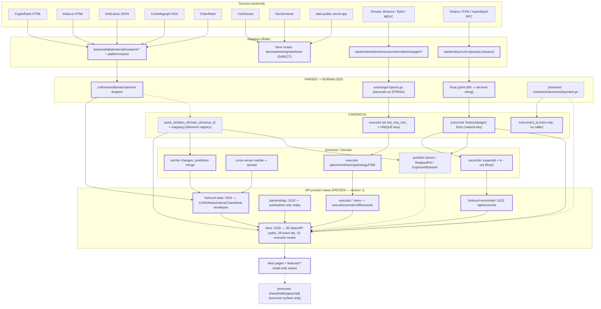

# Canonical placement — where each node lands, and what must not move
> **What this document is.** The placement / boundary companion to
> [`canonical-model.md`](canonical-model.md). That document defines the seven layers and names every
> entity, owner and gap; this one answers a single question the layered diagram does not:
> **for each node in the diagram, does it exist today, what is the exact artifact that realizes it,
> which frozen response envelope does it sit behind, and which existing phase of
> [`migration-plan.md`](migration-plan.md) it belongs to.**
>
> **What this document is not.** It is not a plan rewrite and not new architecture. It adds no
> entity, renames nothing, mints no id and authorizes no migration. Where it says "phase", the phase
> is the one `migration-plan.md` already has, quoted with its ordering constraint. Where a node has
> no phase in that plan, this document says **"no phase exists"** rather than inventing one.
>
> **Vocabulary and owners are reused, not re-derived.** Layer names (RAW → PARSED → NORMALIZED →
> CANONICAL → ENRICHED → DERIVED → PRODUCT VIEW) are `canonical-model.md` §1; entity names and
> owners are its §2; the target-flow diagram is its §8; phases and blockers are its §9 and
> `migration-plan.md`. This file cites those sections rather than restating their evidence.
>
> **The one rule this document exists to state.** The canonical-entities layer is **internal-domain
> modeling plus derived analytics layered BEHIND** the existing product views. It is **never a rewrite
> of them**. Do not break existing frontend clients.
>
> **Snapshot.** Working tree of branch `refactor/frontend-backend-architecture`. The canonical
> workstream landed as `2904749`, `33958a8`, `2830118`, `6531d45` — four commits authored by
> `Fox <fox@local>`. `a8cc4df` (`anvxxr-arch <anvxxr-arch@users.noreply.github.com>`) and `4eb0a13`
> (`omp <omp@local>`) are **not** this workstream's (see §7 (c)); every citation below is the path
> that resolved when the file was read, and every path cited here was re-tested (§7).
>
> **Sibling catalogs (all in this directory, all cited below):**
> [`source-catalog.md`](source-catalog.md), [`data-catalog.md`](data-catalog.md),
> [`data-classification.md`](data-classification.md),
> [`database-classification.md`](database-classification.md),
> [`canonical-acceptance.md`](canonical-acceptance.md), [`migration-plan.md`](migration-plan.md),
> [`SCHEMA.md`](SCHEMA.md).
>
> **Evidence rule.** Every claim carries `path:symbol` or `path:line`. An inferred claim is marked
> `[INFERENCE]`. A node claimed "absent" is reported together with **the grep that returned nothing**.
> **Citation convention.** In table cells that repeat a package many times, a leading short form is
> used for readability and resolves like this: `finance/…`, `accounts/…` and `markets/…` abbreviate
> `apps/api/internal/<same>` (so `[removed: finance/portfolio/portfolio.go]` is
> `[removed: finance/portfolio/portfolio.go]`, and `[removed: markets/overview/market.go]` is
> `[removed: markets/overview/market.go]`); `reference/…` abbreviates
> `apps/api/internal/markets/reference/<same>` (so `reference/ids.go` is
> `apps/api/internal/markets/reference/ids.go`); `common/symbol.json`,
> `finance/allocation.json`, `signals/signal.json` and `markets/instrument.json` abbreviate
> `shared/contracts/schemas/<same>`; `schemas/README.md` is
> `shared/contracts/schemas/README.md`. Every such short form's expansion was tested with `test -f`
> (§7).

---
## 1. Frozen public envelopes — the freeze list
These response shapes MUST stay verbatim. The canonical layer is layered behind them; a change to any
row below is a client-visible break, not a refactor.

**"Unchanged by this workstream" is verifiable, not asserted.** The canonical workstream touched no
envelope-producing code:
```sh
# this workstream's commits only (all authored by Fox <fox@local>)
for c in 2904749 33958a8 2830118 6531d45; do
  git show --stat --format="" $c | grep -E "backend/data|backend/sync|frontend|backend/workers|database/"
done
# → no output: no commit in the workstream touched backend/data, backend/sync,
#   frontend/**, backend/workers/** or database/**
# the same grep over the foreign commits 4eb0a13 (omp <omp@local>) and a8cc4df
#   (anvxxr-arch) is also empty — a strictly stronger claim, and the reason the file's
#   original four-hash set read as one workstream when it was two.
```
Its code delta is additive and confined to `apps/api/internal/markets/{reference,instruments}` (new
packages) — `git show --stat 2904749` — plus two additive lines in `scripts/verify/verify-all.sh` (the
new gates). No route is registered: `backend/api` serves only `/healthz`, `/readyz`,
`/api/auth/{login,callback,logout}`, `/api/admin/members` (`apps/api/main.go:73-100`), and
neither new package serves HTTP.

### 1.1 The `:3101` sidecar families (`fudcourt-data`)
The mux registers **six handlers: `/healthz` plus five API families** —
`apps/data/main.go:156` (`/healthz`), `:176` (`/api/cryptorank`), `:179` (`/api/khala`),
`:182` (`/api/llama`), `:185` (`/api/news`), `:188` (`/api/chainrank`). Where the brief says "six
sidecar families served at `:3101`", the paths it enumerates are the **five** `/api/…` families; the
sixth registered handler is `/healthz`, which reports one key per family (`main.go:161-170`). Both
breadths are covered below — the API rows are the envelope contract, `/healthz` is the readiness
probe (build counts, asserted by `apps/data/main_test.go`).
| family | envelope type (file:symbol) | shape doc | pinned today by | unchanged by this workstream |
|---|---|---|---|---|
| `cryptorank` (28 modes — `cryptorank/modes.go:41` `ModeCount = len(Modes)`) | `CrEnvelope` — `apps/data/internal/research/cryptorank/types.go:438`, built by `envelope.go:36` (`Envelope`) | `SCHEMA.md` §3.1 | `frontend/web/tests/shaper-tests.ts` (TS twin oracle, 28 modes + tamper check), `apps/data/internal/research/paritytest/parity_test.go` (served-bytes parity), `tests/oracle/cr_fetch.py` + `scripts/verify/verify-cryptorank.py` (independent Python oracle) | yes — the commits above touch no file under `backend/data` |
| `khala` (3 modes — `khala/modes.go:65` `ModeCount = len(Modes)`) | `KhEnvelope` — `apps/data/internal/research/khala/shape.go:69` (`KhRow:34`, `KhReport:46`) | `SCHEMA.md` §3.1b | `scripts/verify/verify-khala.py`; frozen mode design in `DR-006` | yes |
| `news` (1 feed — `news/modes.go:81` `SourceCount = len(Sources)`) | `Envelope` — `apps/data/internal/research/news/shape.go:21`, built by `:41` (`Service.Envelope`) | `SCHEMA.md` §3.1c | `scripts/verify/verify-news.py`; `DR-012` | yes |
| `llama` (3 modes — `llama/modes.go:69` `ModeCount = len(Modes)`) | `LlamaEnvelope` — `apps/data/internal/research/llama/shape.go:85`; projection `:210` (`projectProtocols`), `:242` (`projectHistorical`) | `SCHEMA.md` §3.3 (`/api/llama` row) | `scripts/verify/verify-llama.py`; `DR-009` | yes |
| `chainrank` (2 modes — `chainrank/modes.go:63` `ModeCount = len(Modes)`) | **no struct** — upstream body is SPREAD into `map[string]json.RawMessage`: `apps/data/internal/research/chainrank/shape.go:36` (`Service.Envelope`), shape refusal `:64` (`CheckShape`) | `SCHEMA.md` §3.1d | `scripts/verify/verify-chainrank.py`; `DR-013` | yes |

Three of the five families still have a thin Next proxy (`route validates nothing`) and are live:
`frontend/web/src/app/(frontend)/api/{cryptorank,llama,news}/route.ts`. The `khala` and `chainrank`
families have no Next proxy — their boards were removed (DR-041) and they answer on `:3101` only.

### 1.2 The `:3102` `/api/reconcile` shape
| item | artifact | pinned today by | unchanged |
|---|---|---|---|
| Response body `{rows, wallets, walletSummary, source}` | `backend/sync/src/reconciliation/reconcile.rs:237` (`pub fn body`), rows `:37` (`ReconRow`), `:49` (`WalletSummary`); HTTP shell `backend/sync/src/reconciliation/server.rs:24` (`Request`), `:90` (`reason`) | `scripts/verify/verify-reconcile.py` (the 28/28 live harness recorded in `docs/records/DECISIONS.md` DR-019/§reconcile) and the TS oracle twin `frontend/web/src/features/overview/reconcile.ts` | yes |
| Unit/port | `infrastructure/systemd/fudcourt-reconciled.service:20` (`RECONCILE_ADDR=127.0.0.1:3102`) | `scripts/verify/check-deploy.py` (ExecStart-path guard, `scripts/verify/verify-all.sh` step "deploy-unit guard") | yes |
| Next proxy adds `source: "rust"` and answers 502-with-the-real-reason, never a fallback board | `frontend/web/src/app/(frontend)/api/reconcile/route.ts` | `SCHEMA.md` §3.3 `/api/reconcile` row | yes |

### 1.3 The 28-id event catalog
| item | artifact | pinned today by | unchanged |
|---|---|---|---|
| 28 stable `event_type` ids + aliases, `event_version: 1` | `shared/contracts/events/catalog.json` | `shared/contracts/scripts/check-contract.mjs` check (c) — `CONTRACTS_OK … events=28` | yes |
| Event id enum + envelope | `shared/contracts/events/event.schema.json`, `shared/contracts/schemas/event-envelope.json` | `check-contract.mjs` (c) pins catalogue ↔ `event.schema.json` | yes — `event-envelope.json` is pre-existing and untouched (`shared/contracts/schemas/README.md` §1) |

`events/` remains the event source of truth (`canonical-model.md` §9.1, "7–8 — contracts/SDK").

### 1.4 The OpenAPI surface — 36 paths
| item | artifact | pinned today by | unchanged |
|---|---|---|---|
| 36 documented paths / 39 route handlers | `shared/contracts/openapi/fudcourt.yaml` (`grep -c '^  /'` → **36**) | `check-contract.mjs` check (b) → `CONTRACTS_OK enums=3 openapi_paths=36 route_handlers=39 events=28 client_endpoints=17`; and `tests/integration/api/check-api-contract.py` (Go route table ⇄ contract ⇄ web proxies) | yes — non-additive edits to this file are out of scope |

### 1.5 The executor HTTP surface — 15 route handlers
| item | artifact | pinned today by | unchanged |
|---|---|---|---|
| 15 `route.ts` files under `frontend/web/src/app/(frontend)/api/executor/**` (`preview`, `executions{,[id],/[id]/{start,pause,resume,cancel,orders,fills,events}}`, `accounts{,[id],/[id]/test}`, `settings`, `emergency`) | `find 'frontend/web/src/app/(frontend)/api/executor' -name route.ts` → **15** | `check-contract.mjs` (b) (every executor handler documented, none undocumented) + `frontend/web/tests/executor-ui-tests.ts` + `tests/integration/executor/{executor-store-tests.ts,executor-exchange-tests.ts}` | yes |
| served, since `7b8dc2d`, by the **executor process** — not `backend/api` | the 15 `/api/executor/*` routes are served by `backend/workers/executor` (binary `fudcourt-executor`) on its own loopback listener `127.0.0.1:3105` (`FUDCOURT_EXECUTOR_API_ADDR`; `apps/executor/executor/api.go:16,59`, handlers in `apps/executor/internal/api/*`) | `apps/executor/internal/api/routes_test.go` (29 offline tests: route table, auth gate, envelopes) | yes — additive; `backend/api` did not gain these, and the TS runtime is untouched |
**Re-observed 2026-10-01 (after `7b8dc2d`) — historical; superseded 2026-10-02, next paragraph.** At
that observation the 15 Next `route.ts` files carried the full TypeScript implementation
(`platform/executor/{store,runtime}`) and did **not** thin-proxy to `:3105` — `7b8dc2d`'s own message
says "The TS production path is untouched", and `grep -rn '3105' frontend/web/src` (excluding
`node_modules`) returned **no match**, so the same URL was served twice while the cutover was pending.
**Current (2026-10-02, commits `9d7de04`/`f166a0e`).** The re-point is now **coded**: all 15
`/api/executor/*` handlers delegate to one helper,
`frontend/web/src/app/(frontend)/api/executor/_proxy.ts` (`DEFAULT_UPSTREAM_ADDR = '127.0.0.1:3105'`),
enabled only by `FUDCOURT_EXECUTOR_PROXY=go` — default OFF, so the TS runtime is still the live path
and the same URL is still served twice. The earlier "no match" claim is now **false**:
`grep -rn '3105' frontend/web/src --include='*.ts'` returns
`frontend/web/src/app/(frontend)/api/executor/_proxy.ts` (the built `.next/**` output matches too and is
not source). The count (**15**) and the "unchanged by this workstream" verdict both still hold — the
canonical workstream touched none of these handlers. `backend/api` (`:3103`) is a **different**
service and still serves only `/healthz`, `/readyz`, `/api/auth/{login,callback,logout}`,
`/api/admin/members`.
**Boundary statement (restated in §5).** Nothing in §1 is a canonical-entity surface. The canonical
layer's job is to sit *behind* these bodies — a consumer that today parses `CrCoin.Symbol` or the
executor's `symbol` field keeps receiving exactly that body after any canonical work.

---
## 2. The canonical-entity column of the diagram, node by node
Status vocabulary: **FROZEN-RESPONSE-SHAPE** (a wire body a client reads),
**EXISTS-CANONICAL** (a provider-neutral entity with a minted identity),
**EXISTS-PARTIAL** (a type or a value model exists but not the entity),
**GAP** (no artifact).
Names/owners are `canonical-model.md` §2.1–§2.2 — not re-derived here.

### 2.1 `{Asset, Token, Chain}`
| node | status | artifact that realizes it (file:symbol) | frozen contract it must not disturb | owner | what is missing |
|---|---|---|---|---|---|
| **Asset** | **EXISTS-CANONICAL** (id) + **GAP** (store/route) | `apps/api/internal/markets/reference/ids.go` (`MintID`), `seed.go` (`Seed()`: 8 assets), `registry.go:486` (`Resolve`), `:601` (`ByID`); emitted instance `shared/contracts/data/reference.json` (`assets`=8, `mappings`=49) | every money row that carries the **symbol string**: `transactions` rows (`/api/transactions`), the `assets` snapshot behind `/api/all` + `/api/coins`, `CrCoin` rows on `/api/cryptorank` | `apps/api/internal/markets/reference` | no SQL table, no route, no consumer; `shared/contracts/schemas/README.md` §2.2 records `asset_id` minted + instance emitted, runtime adoption open |
| **Token** | **EXISTS-CANONICAL** (id) + **EXISTS-PARTIAL** (runtime) | `reference/ids.go` over natural key `token/<chain-name>/<FULL address>` (11 seeded); runtime readers are address-only: `frontend/web/src/features/dex/client.ts:73` (`DexToken`), `backend/sync/src/streams/sync.rs:192` (`mint.chars().take(6)`) and `:196` (`format!("SPL:{short}")`) — **truncates SPL mints to 6 chars** | `api/dex` rows (`DexPair.baseToken/quoteToken`) and the SPL-labelled rows inside the `assets` snapshot | `apps/api/internal/markets/reference` (ids); **runtime owner absent** — nearest `frontend/web/src/features/dex` | the truncated SPL label is **lossy and stays short** — the minted id is built from the full address, so the two cannot be reconciled from the label alone |
| **Chain** | **EXISTS-CANONICAL** (id) + **EXISTS-PARTIAL** (durable table) | `reference/seed.go` (9 chains, `kind` `evm`/`svm`/`offchain`, `display_name`); `registry.go:554` (`ChainByName`); emitted `reference.json` (`chains`=9) | the lowercase `chain` **string** on `transactions` rows and `assets` rows, and the label set `[removed: accounts/wallets/wallets.go]` (`chainRules`, 7 chains) validates | `apps/api/internal/markets/reference` (ids); `[removed: accounts/wallets]` still validates the label | no join from the string column to `chain_id`; `backend/sync/src/chains.rs:13`/`:79` remains a private static registry (per-process — `[INFERENCE]` it cannot serve as the store-wide registry) |

### 2.2 `{Account, Balance, Position, Ledger, Portfolio}`
| node | status | artifact (file:symbol) | frozen contract it must not disturb | owner | what is missing |
|---|---|---|---|---|---|
| **Account** | **EXISTS-PARTIAL** (three genuinely different nouns share the name — `canonical-model.md` D3) | `[removed: finance/treasury/treasury.go]` (`Account`), `accounts/exchange/account.go:102` (`ExchangeAccount`), `[removed: accounts/wallets/wallets.go]` (`Wallet`, address PK) | `/api/wallets` rows and the executor account surface (`/api/executor/accounts[/{id}]`) | **split**: `[removed: finance/treasury]` + `accounts/exchange` + `[removed: accounts/wallets]` | one canonical `Account` id; the three are deliberately *not* the same concept, so the gap is a naming/boundary decision, not a merge |
| **Balance** | **EXISTS-PARTIAL** | read model `[removed: finance/ledger/ledger.go]` (`BalanceByAsset map[string]string`); executor `apps/executor/internal/core/execution/records.go:163` (`Balance{Asset,Free,Used,Total}` decimal strings); at rest `executor.balance_snapshots.payload jsonb` (`database/schema/executor-schema.sql:157-162`) | `/api/all`, `/api/coins`, `/api/executor/accounts` | **owner absent** for the read model (executor owns its snapshot) | a `Balance` type keyed by `(account_id, asset_id, observed_at)`; the SQL carrier is untyped jsonb |
| **Position** | **EXISTS-PARTIAL** (two distinct implementations, `canonical-model.md` §2.2) | venue truth `apps/executor/internal/core/execution/records.go:182` (`Position`, signed quantity); derived `[removed: finance/portfolio/portfolio.go]` (`Position{InstrumentID,Quantity,EntryPrice,UnrealizedPnl}`) | `/api/executor/executions/[id]` (venue-truth snapshot) | **split**: `apps/executor/internal/exchanges` (venue truth; the old `internal/exchange` path does not resolve) + `[removed: finance/portfolio]` | the venue key is `(symbol, positionSide)` with no minted id; the derived twin already keys on `InstrumentID` — the two are different domains by design |
| **Ledger** | **EXISTS-CANONICAL** (type) / **storage mismatch** | `[removed: finance/ledger/ledger.go]` (`Entry`), `:134` (`IdempotencyKey`), `:179` (`BalanceByAsset`) | no route serves entries; the **SQL `ledger` table** (`database/schema/pg-schema.sql:43-50`) is a per-account balance snapshot, read by `frontend/web/src/server/db.ts` and `/api/all` | `[removed: finance/ledger]` | a table that matches `Entry`; `canonical-model.md` §2.2 marks the SQL counterpart as misleading (`no writer`) |
| **Portfolio** | **DERIVED** — not an entity at all | `[removed: finance/portfolio/portfolio.go]` (`Derive`), `:77` (`Valuation`), `:169` (`ExposureByAsset`), `pnl.go:59` (`RealizedPnl`) | `/api/all` net-worth figure (`frontend/web/src/server/db.ts` `getAll`) | `[removed: finance/portfolio]` | **nothing canonical, deliberately** — Portfolio is a computed view over Asset/Balance/Position. Its recorded defect is time, not identity: `AsOf = time.Now().UnixMilli()` stamped inside the derivation (`portfolio.go:140`, `canonical-model.md` T6) |

### 2.3 `{Instrument, Price, Candle, Order, Fill}`
| node | status | artifact (file:symbol) | frozen contract it must not disturb | owner | what is missing |
|---|---|---|---|---|---|
| **Instrument** | **EXISTS-CANONICAL** (the only near-complete canonical entity, `canonical-model.md` §2.1) | `[removed: markets/instruments/canonical.go]` (`MintInstrumentID`), `:351` (`ResolveInstrument`), `:53` (`InstrumentKind`), `:57` (`InstrumentIDSalt`); legacy spelling `instrument.go:53` (`InstrumentID`), `symbol.go:35`/`:81` (`CanonicalSymbol`/`VenueSymbol`) | the `symbol` echo inside every executor body (`/api/executor/**`) and the `/api/ticker` rows | `[removed: markets/instruments]` | no emitted artifact and no route: a consumer can obtain an id only by calling `ResolveInstrument` in-process (`canonical-model.md` O4/O1 remaining work is *plumbing*) |
| **Price** | **GAP** | **no type.** Nearest carrier `[removed: markets/overview/market.go]` (`Ticker.Bid/Ask/Last`, decimal strings); SQL `price_history(symbol, ts, source)` (`database/schema/pg-schema.sql:132-141`) has **no writer** | `/api/ticker` rows; `VenueQuote` on the ticker board | **owner absent** — `[removed: markets/overview]` holds the shape only | a `Price` type with `instrument_id` + `source_id` + `observed_at`; the existing table's UNIQUE key is `(symbol, ts, source)` — **symbol-as-identity**, the exact anti-pattern |
| **Candle** | **EXISTS-PARTIAL** | `[removed: markets/overview/market.go]` (`Candle{Exchange,Symbol,Interval,OpenTime,…}`); served on request by `/api/ticker` | `/api/ticker` rows and `features/ticker/detail.tsx` | `[removed: markets/overview]` | no store: `grep -ri candle database/` → **no table** (recorded in `canonical-model.md` §2.1 and `data-catalog.md` §2); no canonical id (tuple `(Exchange, Symbol, Interval, OpenTime)`) |
| **Order** | **FROZEN-RESPONSE-SHAPE** + **EXISTS-CANONICAL** | `apps/executor/internal/core/execution/records.go:76` (`ChildOrderRecord`); minted `client_order_id = fud_<executionId>_<seq>` (`apps/executor/internal/runtime/idempotency/idempotency.go:38-40`, `ClientOrderID`); UNIQUE `(execution_id, client_order_id)` (`database/schema/executor-schema.sql:106-123`) | `/api/executor/executions/[id]/orders` (OpenAPI + `route.ts`) | `apps/executor/internal/core/orders` | nothing — the id space is minted, durable and enforced by a UNIQUE constraint |
| **Fill** | **FROZEN-RESPONSE-SHAPE** + **EXISTS-CANONICAL** | `apps/executor/internal/core/execution/records.go:96` (`FillRecord`); dedup key `apps/executor/internal/runtime/idempotency/idempotency.go:83-85` (`FillDedupKey`); UNIQUE `(account_id, exchange_trade_id)` (`database/schema/executor-schema.sql:141`) | `/api/executor/executions/[id]/fills` (OpenAPI + `route.ts`) | `apps/executor/internal/exchanges` | nothing — the dedup key **is** the guarantee, not a synthetic id |

> Blunt summary of this column. Of the **thirteen** nodes listed, **three are fully canonical**
> (Instrument, Order, Fill — minted id, durable shape, enforced key), **four hold a minted canonical
> identity while the runtime around them is incomplete** (Asset, Token, Chain, and Ledger as a type
> with no matching table), **four are partial types** (Account, Balance, Position, Candle), **one is
> deliberately derived** (Portfolio) and **one is a gap** (Price). The middle column is not "unbuilt"
> — it is *unevenly* built, and the unevenness is exactly what §4 places.

---
## 3. The derived / enriched column
DERIVED = computed from canonical facts, no store. ENRICHED = canonical ⋈ canonical, i.e. a join
across two identity spaces. `canonical-model.md` §1.5–§1.6 is the layer definition; the rows below
are placement.
| node | what exists NOW (file:symbol) | kind | what is absent |
|---|---|---|---|
| **PnL** | `[removed: finance/portfolio/pnl.go]` (`RealizedPnl`), inputs `:21` (`EntryFill`), `:30` (`ExitFill`) | **DERIVED** — pure function, no store, no route | a served surface: nothing returns a PnL body today; also `trades.pnl` is a **stored** derived value in SQL (`database/schema/pg-schema.sql:52-62`) with no writer — the opposite of this row's posture |
| **Exposure** | `[removed: finance/portfolio/portfolio.go]` (`Exposure`), `:169` (`ExposureByAsset`); canonical id already used: `Position.InstrumentID` (`portfolio.go:49`) | **DERIVED** — no store | asset-side identity: exposure is keyed by the **asset symbol** (`Exposure.Asset`), not by `asset_id` |
| **Signals** | `frontend/web/src/app/(frontend)/api/signals/route.ts:10` (`SignalRow`), `:44` (`ScoreboardPayload`); schema `shared/contracts/schemas/signals/signal.json` + `scoreboard.json` | **PRODUCT VIEW passthrough** — upstream `data-public.vercel.app`, provider-owned; producer and consumer are the same service | owner, a Go type, a route in `backend/api`, and any canonical join: `chain`/`mint`/`symbol` are provider strings (`canonical-model.md` §2.2 `Signal` — "owner absent"); `grep -rn 'signal' shared/contracts/data/reference.json` → **0** (no signal id in the registry) |
| **Trends** | **nothing.** The only `Trend` token in the tree is the CryptoRank **provider row** `CrTrendingRow` (`apps/data/internal/research/cryptorank/marshal.go:60`) | **GAP** | a canonical `Trend` entity; `grep -rniI '\btrends?\b' backend/api/internal` → no matches |
| **Valuation** | `[removed: finance/portfolio/portfolio.go]` (`Valuation`), `:97` (`Derive`); consumer `/api/all` (`platform/db/client.ts` `getAll`); schema `shared/contracts/schemas/finance/valuation.json` | **DERIVED** — no store ("NONE (computed)", `data-classification.md` §2.3) | one missing thing: `TotalValueUSD` is nil whenever **any** holding lacks a price, and the price used never persists its source (`data-catalog.md` §4 "Valuation prices" — `assets.value_usd` has no `source_id`) |
| **Allocation** | `[removed: finance/treasury/treasury.go]` (`Allocate`), `:46` (`Allocation`), `:60` (`Movement`), `:76` (`Balances`); schema `finance/allocation.json` | **should be ENRICHED** — a join of account ⋈ movements ⋈ balances; today a value model with no store (`data-catalog.md` §6: "no table") | a store and a route; `canonical-model.md` §2.3 lists Allocation as CANONICAL-by-contract with owner `[removed: finance/treasury]` |

**The line between the two.** PnL / Exposure / Valuation are DERIVED by construction and must stay
unstored — storing them would create a second source of truth for a number that is a function of
others. Allocation and Signals are the two rows that must become **ENRICHED joins** (canonical ⋈
canonical) rather than staying as value models / provider passthroughs.

---
## 4. Diagram-only nodes are GAPS — place them, do not start a parallel track
Each row is placed into a phase that **already exists** in `migration-plan.md`, quoted with its
ordering constraint. Where no phase exists, this document says so.
| node | status | evidence it is absent (the grep that returned nothing) | the existing phase it belongs to (quoted ordering) | what that phase would have to add |
|---|---|---|---|---|
| **Macro** source (+ `MacroSeries`/`MacroObservation`) | **ABSENT** | `grep -rniIw "macro" backend/data backend/sync/src backend/api/internal frontend/web/src shared/contracts database tests --include='*.go' --include='*.ts' --include='*.json'` → **1** hit, and it is a press headline inside a recorded fixture (`tests/fixtures/expected/aioverview.json:47`, "JPMorgan, Citi and Barclays"); `grep -rniI "MacroSeries\|MacroObservation" …` → **1** hit, the schema README's own "deliberately missing" table row (`shared/contracts/schemas/README.md:159`) | **No phase exists.** `migration-plan.md` Phases 1–10 contain no macro entry (`grep -niE 'macro' docs/architecture/migration-plan.md` → no matches). The only recorded home is a *decision action*: `canonical-acceptance.md` §3 **P2** "Answer O6 (macro) explicitly or leave it absent", artifact `docs/records/DECISIONS.md` + `shared/contracts/schemas/`, blocked on **product owner** | a decision record first. Only if the answer is "yes": a provider, a package under `apps/data/internal/research/`, a table, a route, a feature directory — then `macro/` schemas. `schemas/README.md` §5 states writing `macro/` now "would describe a system that does not exist" |
| **Bank** source (accounts / statements / imports) | **ABSENT** | `grep -rniI "iban\|bank_?account\|bankstatement\|bank_?import" …` → no bank client, no import route; the only near-hit is the `accounts.statement` TEXT column, a chart-of-accounts label (`docs/architecture/source-catalog.md` §8 row BANK; `data-catalog.md` §9 "Bank accounts / statements / imports — Absent") | **No phase exists.** The acquisition pattern that *would* own it is recorded as a decision line, not a phase: `DR-005` → `DR-009` → `DR-012` → `DR-013` moved each read-only family into the Go sidecar. Institutionally it slots into **Phase 4** — *"Ordering: after Phase 3; strictly before Phase 5…"* — as a new family in `backend/data`, with the `verify-*.py` harness copied from `scripts/verify/verify-news.py` | a source table row, a fetch+parse package, an envelope, a thin Next proxy, a verifier, and a sensitivity class (bank data is at least INTERNAL/USER_PRIVATE, not PUBLIC) |
| **Cash** source (manual / non-chain assets) | **ABSENT** | `grep -rniIw "cash" backend/data backend/sync/src backend/api/internal frontend/web/src shared/contracts database tests --include='*.go' --include='*.ts' --include='*.rs' --include='*.sql'` → **2 substantive hits**, both comments in the ledger kind table: `[removed: finance/ledger/ledger.go]` (`KindDeposit Kind = "deposit" // external cash in`) and `:28` (`KindWithdrawal … // external cash out`). No cash entity, no cash account, no cash import. Confirmed by `source-catalog.md` §8 row CASH and `data-catalog.md` §9 | **No phase exists** as a data source. The closest existing work item is the **P0** in `canonical-acceptance.md` §3: *"Decide the writer-less tables (`accounts`, `journal`, `ledger`, `trades`, `venues`, `price_history`)… a table with DDL, readers and no writer is a silent correctness hole"*, whose blocking precondition is **O2 must be answered first** | a decision on whether cash is a `LedgerEntry` kind, a treasury account, or a source family — then either an `assets`-shaped row type or new DDL. Doing it before O2 would add a fourth writer-less table |
| **Durable Asset/Token registry** (SQL) | **HALF DONE (DR-036)** — code + JSON artifact + the SQL table and its loader exist; what is missing is the load actually being run and any consumer being re-pointed | `grep -rniI "provider_id\|canonical_id" database/` now returns the DR-036 DDL (`database/schema/pg-schema.sql`: `canonical_reference`, `canonical_reference_miss`); before DR-036 it was **0** matches. The loader is `apps/api/internal/markets/reference/loader.go`; it is additive and unwired, so nothing resolves through the table yet. Still confirmed: no FK from `transactions.venue_id`→`venues.id` etc. (`database-classification.md` §6 finding 6.2/6.8) | **Phase 2 — `database/` extraction**, ordering *"Ordering: after Phase 1; before Phase 3 (contracts embed the DDL)."* The work is `canonical-acceptance.md` §3 **P0** row 1: *"Mint + persist a `(provider, provider_id) → canonical_id` table (and `*_id` columns on the money-bearing rows) via a migration"* — artifact `database/schema/{pg-schema.sql,executor-schema.sql}` + a new migration, owner `backend/api` (registry) + the Postgres write path (`frontend/web/src/server/db.ts`), **blocking precondition: "O2 must be answered first … this is a migration, so it is explicitly out of this round"** | the remaining work is now running the load and adding the `*_id` columns — the DDL and the loader for `shared/contracts/data/reference.json` both exist (DR-036, additive and unwired; **no `database/migrations/`** — DR-020 never created one and both the DDL and the load statement are idempotent). `canonical-model.md` §9.1 (Phase 9) now records its former blocker **(a) a SQL-side mapping table** as **DONE**, leaving only the re-pointing |
| **Signals as a canonical entity** | **PARTIAL** — a schema exists, no Go type, no owner, no id space | `grep -rniI "signal_id\|signals/signal.json" backend/api backend/workers shared/contracts/data` → **0** matches: no Go signal type and nothing in `reference.json`. The only implementation is the TS route-local type (`api/signals/route.ts:10`) — `canonical-model.md` §2.2 `Signal`: "owner absent — `frontend/web` read proxy only" | **Delivery half has a phase — Phase 4**, *"Ordering: after Phase 3; strictly before Phase 5 (executor orchestration is part of backend/api…)"*, and its cleanup in **Phase 7** (*"data-passthrough routes replaced by `backend/data` via `backend/api` (post-4)"*). **The minting half has no phase** — `migration-plan.md` mentions no signals entity | Phase 4 adds a Go handler for the existing `/api/signals` path; canonicalizing `Signal` additionally needs an owner, a natural key and a mapping row (the provider `(id, mint)` composite is provider-owned) |
| **Trends as a canonical entity** | **ABSENT** | `grep -rniI "\btrends?\b" backend/api/internal` → no matches; the only `Trend` token in Go is the provider row `CrTrendingRow` (`apps/data/internal/research/cryptorank/marshal.go:60`) | **No phase exists.** `migration-plan.md` names no trends surface; `canonical-model.md` §2 has no `Trend` entity | a definition first (is a Trend a derived window over `Candle`/`Price`, or a provider-supplied signal class?), then an owner. Until then it must not be added to the schemas tree — same posture as `macro/` |
| **Product Views / API-SDK layer** | **PARTIAL** — the views are live and frozen (§1); the SDK exists but covers one surface | SDK: `[removed: shared/sdk/typescript]/{src/client.ts, src/events.ts, src/generated/schema.d.ts, scripts/gen-events.mjs}` generated from the OpenAPI by `package.json` → `generate` (`openapi-typescript ../../contracts/openapi/fudcourt.yaml …`). **Not adopted by any feature** — `frontend/web/src/features/*/client.ts` still hand-declare their wire types (`canonical-model.md` §1.1/§1.2) | **Phase 3 — `shared/contracts`**, *"Ordering: after Phase 2; before Phases 4–6 (each service port consumes contracts)"* (amended: executor surface executed, *"the data/sync/api HTTP surfaces are being added to the same contract + SDK in a follow-up pass"*), plus **Phase 7** — *"`src/features/executor/client.ts` re-targeted to `[removed: shared/sdk/typescript]`"* | Phase 3 adds the data/sync/api surfaces to OpenAPI + the SDK; Phase 7 swaps the feature clients over. Both are additive: the frozen bodies in §1 do not change |

---
## 5. Reading of the whole diagram
The diagram is honest about layers and optimistic about arrows: every **product view** and the
**executor store** are real end-to-end, while the **canonical** and **derived** columns are largely
in-process today — the reference registry has an owner and a published artifact but no HTTP route,
the instrument minter has no caller in the acquisition path, and the derived portfolio functions have
no route at all. So the middle of the diagram is not "the missing layer" any more (that was
`canonical-model.md` §8's original reading, kept there as the pre-registry record); it is **a layer
that exists in code and has not yet been wired between the producers and the frozen envelopes**. The
placement rule that follows: build the canonical/derived column *behind* §1's envelopes, never by
reshaping them.



Legend — **solid = real today** (bytes flow on that edge in this tree); **dotted = aspirational**
(the edge is designed but no caller exists). Specifically:
- **Real:** sources → adapters → shapers; shapers → the `:3101` envelopes; adapters → executor ids and
  the ledger/balance derivations (in-process); `C4 → E3 → P2 → P4` (reconcile is served);
  `C3 → E5 → P5 → P4` (the executor store is served); `P1/P2/P3/P5 → P4 → F1`.
- **Aspirational:** `N1 -.-> C1` (no shaper mints a canonical id); `N4 -.-> P4` (the instrument
  minter has no caller and no emitted artifact); `E4 -.-> P4` (no route serves `[removed: finance/portfolio]`);
  `F1 -.-> F2` (features keep hand-declared wire types; the SDK is not imported).
- **Deliberately NOT drawn:** any arrow *into* a frozen envelope that would require reshaping it.
  §1's bodies are terminals, not pass-throughs.

**Explicit boundary statement.** This diagram does not authorize reshaping any existing response
envelope. Every canonical id is **additive**: `asset_id`, `token_id`, `chain_id`, `venue_id`,
`instrument_id` are new fields/new artifacts beside the symbol strings the envelopes already carry,
never replacements for them. The freeze list (§1) is the constraint the canonical workstream is
subordinate to, and `canonical-model.md`'s own header states the same rule — *"It is not a migration
and it authorizes no renames."*

---
## 6. What a consumer must do
1. **Resolve ids, never parse them.** A `(provider, provider_id)` pair becomes a canonical id through
   the published table — `shared/contracts/data/reference.json` (`mappings`, 49 rows) or, in Go,
   `apps/api/internal/markets/reference/registry.go:486` (`Reference.Resolve`); an instrument
   through `[removed: markets/instruments/canonical.go]` (`ResolveInstrument`) over a
   registry built by `reference.Build()` (`registry.go:104`).
2. **Never derive an id yourself.** Never hash, slice, or pattern-match an id string: the id is
   opaque and its preimage is the owner's. `reference.Resolve` **refuses** an unknown provider
   (`ErrUnknownProvider`) and an unknown identifier (`ErrUnknownIdentifier`) and matches verbatim —
   a miss is a miss, not a fuzzy hit. `MintInstrumentID`'s salt (`canonical.go:57`,
   `fudcourt/canonical-instrument/v1`) is pinned by `TestInstrumentIDGoldenVector`; assuming a
   different salt silently re-mints every instrument.
3. **Never match on a symbol.** Symbols are **spellings**, not identity (`common/symbol.json`;
   `canonical-model.md` D5/O4). `BASE/QUOTE` is the canonical symbol and
   `exchange:marketType:BASE/QUOTE` the legacy human-readable spelling; neither is the id.
4. **Treat provider fields as display-only.** `exchange`, `symbol`, `chain`, `asset`, provider `slug`
   and provider ids exist so a human can read a row. They are not join keys, not stores of truth and
   not inputs to identity — the **10** acquisition-side DTO leaks (`data-classification.md` Part A's
   verdict counts: 3 contained, 10 leaks, 1 leaks by design, 1 leaks at the type level) and the two
   symbol-keyed SQL unique constraints are the recorded cost of ignoring this
   (`data-classification.md` Part A; `canonical-model.md` §7).
5. **Additive only.** A consumer may start reading `*_id` fields as they appear; it may not require
   them, and it must not stop reading the fields it reads today — the frozen bodies in §1 keep their
   current shape.

### 6.1 Where a consumer gets an id today — and where it cannot
| the consumer has | the resolver that exists NOW | the resolver that does not exist |
|---|---|---|
| `(provider, provider_id)`, e.g. `("cryptorank", "bitcoin")` | `shared/contracts/data/reference.json` → `mappings` (49 rows, read by any language), or Go `reference.Build()` then `Reference.Resolve` (`registry.go:104`, `:486`) | — (the artifact is the runtime channel until a route serves it) |
| a canonical id, checking it exists | `Reference.ByID` (`registry.go:601`), `Asset:517`/`Token:529`/`Chain:541`/`Venue:566` | — |
| a chain name or a token address | `Reference.ChainByName:554`, `Reference.TokenByAddress:582` | — |
| a venue + market type + **resolved components** | `instruments.ResolveInstrument` (`canonical.go:351`) over a registry from `reference.Build()` | an emitted instrument artifact or HTTP route — the id can be minted in-process only (`canonical-model.md` O4/O1) |
| a **symbol spelling** | `instruments.ParseInstrumentSpelling` (`canonical.go:203`), `CanonicalSymbol`/`VenueSymbol` (`symbol.go:35`,`:81`) — these produce **spellings**, not ids | — (by design: a spelling is not an identity) |
| a SQL/Postgres-side join | `canonical_reference` (+ `canonical_reference_miss`), declared in `database/schema/pg-schema.sql` and loaded from `reference.json` by `apps/api/internal/markets/reference/loader.go` (DR-036; additive and unwired — nothing loads it yet), so the schema-level "nothing" is fixed | the loaded rows themselves — `grep -rniI "INSERT INTO canonical_reference"` outside the loader → **0** matches: no process has run the load (§4, the standing P0's remaining half) |

---
## 7. Verification record
Commands run for this document, from the repo root, on the working tree it describes.
```sh
# (a) every gate cited in §1 still green
node shared/contracts/scripts/check-contract.mjs
# → CONTRACTS_OK enums=3 openapi_paths=36 route_handlers=39 events=28 client_endpoints=17   (exit 0)
node shared/contracts/scripts/check-schemas.mjs
# → SCHEMAS_OK files=56 refs=344 enums=148                                                (exit 0)
python3 -c "import json,glob;[json.load(open(f)) for f in glob.glob('shared/contracts/schemas/**/*.json',recursive=True)]"
# → (no output, exit 0) — every schema file is valid JSON

# (b) the counts this document states
grep -c "^  /" shared/contracts/openapi/fudcourt.yaml                       # → 36
find "frontend/web/src/app/(frontend)/api/executor" -name route.ts | wc -l   # → 15
python3 -c "import json;d=json.load(open('shared/contracts/data/reference.json'));print({k:len(d[k]) for k in ['chains','assets','tokens','venues','mappings','misses','unmapped']})"
# → {'chains': 9, 'assets': 8, 'tokens': 11, 'venues': 12, 'mappings': 49, 'misses': 3, 'unmapped': 7}

# (c) the freeze claim: this workstream's commits touch no envelope-producing code
#     (four commits, all authored by Fox <fox@local>; verified with
#      git show -s --format='%h %an <%ae> %s' <hash>)
for c in 2904749 33958a8 2830118 6531d45; do
  git show --stat --format="" $c | grep -E "backend/data|backend/sync|frontend|backend/workers|database/"
done                                                                     # → no output
# the foreign commits of the same era — 4eb0a13 (omp <omp@local>, docs-repoint only) and
# a8cc4df (anvxxr-arch) — are empty under the same grep too, but they are NOT this
# workstream's and are not counted as evidence for it.

# (d) every relative link in this document resolves
for l in source-catalog.md data-catalog.md data-classification.md database-classification.md \
         canonical-acceptance.md migration-plan.md SCHEMA.md canonical-model.md; do
  test -f docs/architecture/$l || echo "BROKEN $l"
done                                                                     # → no output (8/8 resolve)

# (e) path sweep: every concrete path cited in this document, plus the 23 documented
#     short-form expansions from the header's citation convention, each tested with `test -e`
# → 111 distinct paths checked, 0 miss
# (f) the schemas/README.md layout correction: the phantom directory never existed
ls shared/contracts/     # README.md data events openapi schemas scripts
ls shared/contracts/schemas/   # README.md accounts assets common defi error-envelope.json
                               # event-envelope.json finance markets research signals trading
# → `events` is a sibling of `schemas`, absent from the second listing, both before and after
```
Every path-like citation in this document was re-tested with `test -f` / `test -e` — **111 distinct
paths checked, 0 miss** — plus the 8 sibling-document links above (9 relative links total, 0 broken).
The two `ls` captures of `shared/contracts/` and `shared/contracts/schemas/` (before/after the
`schemas/README.md` layout correction described in the session report) show the same six and twelve
entries respectively — i.e. `events/` was never a child of `schemas/`, which is what that correction
fixes, and the phantom `schemas/events/` line could not have been caught by `check-schemas.mjs`: that
gate indexes only `shared/contracts/schemas/**/*.json` (56 files, **0** under any `events/` path) and
checks only README links whose target ends in `.json`, resolving them relative to `schemas/`. A prose
tree block naming a directory is outside both sets.
